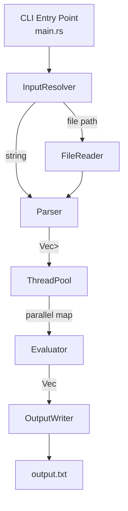

# Design Document: Multithreaded Calculator

## Overview

A Rust CLI application that parses binary math equations from either a command-line string or a file, evaluates them concurrently using a thread pool, and writes ordered results to `output.txt`. The design prioritizes correctness (preserving input order despite concurrent evaluation), clear error propagation, and a clean separation between parsing, evaluation, and output concerns.

Key design decisions:
- Rust's `std::thread` + channels (or `rayon`) for the thread pool — rayon is preferred for its work-stealing scheduler and simple API
- Results are collected into a pre-sized `Vec` indexed by input position to guarantee output order
- Errors (parse errors, division by zero) are represented as `Result` values and written inline rather than aborting the run

---

## Architecture



The application is structured as a pipeline:

1. **Input Resolution** — determine whether input is a raw string or a file path, then produce a raw string
2. **Parsing** — tokenize the raw string into a `Vec<Result<Equation, ParseError>>`
3. **Concurrent Evaluation** — map each `Equation` through the evaluator using a thread pool; errors pass through unchanged
4. **Output Writing** — serialize results in original order to `output.txt`

---

## Components and Interfaces

### `main.rs` — Entry Point

Parses CLI arguments (using `clap` or manual `std::env::args`), resolves the input source, orchestrates the pipeline, and handles top-level errors (missing args, file not found) by printing to stderr and exiting non-zero.

```
fn main() -> ExitCode
```

### `input.rs` — Input Resolution

```rust
pub fn resolve_input(arg: &str) -> Result<String, InputError>
```

Checks whether `arg` is a readable file path. If yes, reads and returns its contents. Otherwise treats `arg` as a raw equation string. Returns `InputError` if the file exists but cannot be read.

### `parser.rs` — Parser

```rust
pub fn parse_equations(input: &str) -> Vec<Result<Equation, ParseError>>
pub fn format_equation(eq: &Equation) -> String
```

- Splits `input` on commas and whitespace runs to produce tokens
- Groups tokens into triples `(lhs, op, rhs)` and parses each into an `Equation`
- `format_equation` serializes an `Equation` back to `"<lhs> <op> <rhs>"` string form

### `evaluator.rs` — Evaluator

```rust
pub fn evaluate(eq: &Equation) -> Result<f64, EvalError>
```

Pattern-matches on `eq.operator` and applies the corresponding arithmetic. Returns `EvalError::DivisionByZero` when the right operand is zero for `/`, `%`, or `//`.

### `pool.rs` — Thread Pool / Concurrent Evaluation

```rust
pub fn evaluate_all(equations: Vec<Result<Equation, ParseError>>) -> Vec<EvalResult>
```

Uses `rayon::iter::ParallelIterator` to map over the input slice. Each item is either a `ParseError` (passed through) or an `Equation` (evaluated). The parallel map preserves index order via `rayon`'s `collect`.

### `output.rs` — Output Writer

```rust
pub fn write_results(equations: &[Result<Equation, ParseError>], results: &[EvalResult]) -> Result<(), OutputError>
```

Zips equations with results, formats each line as `<equation_string> = <result_or_error>`, and writes to `output.txt` (overwriting if present).

---

## Data Models

```rust
/// A parsed binary equation
#[derive(Debug, Clone, PartialEq)]
pub struct Equation {
    pub lhs: f64,
    pub operator: Operator,
    pub rhs: f64,
}

#[derive(Debug, Clone, PartialEq)]
pub enum Operator {
    Add,        // +
    Sub,        // -
    Mul,        // *
    Div,        // /
    Mod,        // %
    FloorDiv,   // //
}

/// Result of evaluating one equation
pub type EvalResult = Result<f64, CalcError>;

#[derive(Debug, Clone, PartialEq)]
pub enum CalcError {
    Parse(ParseError),
    Eval(EvalError),
}

#[derive(Debug, Clone, PartialEq)]
pub enum ParseError {
    InvalidOperator(String),
    InvalidOperand(String),
    MalformedEquation(String),
    NoValidEquations,
}

#[derive(Debug, Clone, PartialEq)]
pub enum EvalError {
    DivisionByZero,
}

#[derive(Debug)]
pub enum InputError {
    FileNotFound(String),
    FileReadError(String),
}
```

### Output line format

| Scenario | Output line |
|---|---|
| Successful evaluation | `3.5 + 2 = 5.5` |
| Division by zero | `4 / 0 = error: division by zero` |
| Parse error | `foo bar = error: malformed equation 'foo bar'` |


---

## Correctness Properties

*A property is a characteristic or behavior that should hold true across all valid executions of a system — essentially, a formal statement about what the system should do. Properties serve as the bridge between human-readable specifications and machine-verifiable correctness guarantees.*

### Property 1: Delimiter splitting produces correct equation count

*For any* non-empty list of valid equation strings joined by arbitrary combinations of commas and whitespace, parsing the joined string should produce exactly as many successfully-parsed equations as there were in the original list.

**Validates: Requirements 1.1, 2.3**

---

### Property 2: Malformed tokens produce parse errors

*For any* input token that does not match the pattern `<Real_Number> <Operator> <Real_Number>` (e.g. missing operand, unknown operator, non-numeric operand), the parser should return a `ParseError` rather than a valid `Equation`.

**Validates: Requirements 3.1, 3.2**

---

### Property 3: Arithmetic correctness for all operators

*For any* two finite `f64` values `lhs` and `rhs` where `rhs != 0`, and for each of the six supported operators, the evaluator should return the mathematically correct result: sum for `+`, difference for `-`, product for `*`, quotient for `/`, remainder for `%`, and floor of quotient for `//`.

**Validates: Requirements 4.1, 4.2, 4.3, 4.4, 4.5, 4.6**

---

### Property 4: Division by zero yields an error

*For any* finite `f64` value `lhs` and any of the operators `/`, `%`, or `//` with `rhs = 0`, the evaluator should return `EvalError::DivisionByZero` rather than a numeric result.

**Validates: Requirements 5.1**

---

### Property 5: Output lines match the required format

*For any* equation (whether it evaluates successfully or produces an error), the formatted output line should match the pattern `<lhs> <op> <rhs> = <result_or_error_description>`.

**Validates: Requirements 5.2, 7.2**

---

### Property 6: Output order matches input order

*For any* list of equations, the lines written to `output.txt` should appear in the same order as the input equations, regardless of the order in which the thread pool completes individual evaluations.

**Validates: Requirements 6.3, 7.3**

---

### Property 7: Parser round-trip consistency

*For any* valid equation string `s`, parsing `s` to an `Equation`, formatting that `Equation` back to a string, then parsing again should produce an `Equation` structurally equivalent to the first parse result — i.e., `parse(format(parse(s))) == parse(s)`.

**Validates: Requirements 8.1, 8.2, 8.3**

---

## Error Handling

| Error condition | Component | Behavior |
|---|---|---|
| No CLI argument provided | `main` | Print usage to stderr, exit non-zero |
| File path provided but file not found | `input.rs` | Print `"error: file not found: <path>"` to stderr, exit non-zero |
| File exists but cannot be read | `input.rs` | Print `"error: cannot read file: <path>: <os error>"` to stderr, exit non-zero |
| No valid equations in input | `main` | Print `"error: no valid equations found"` to stderr, exit non-zero |
| Malformed equation token | `parser.rs` | Return `ParseError`; written to output line as `"error: <description>"` |
| Unrecognized operator | `parser.rs` | Return `ParseError::InvalidOperator`; written to output line |
| Division by zero | `evaluator.rs` | Return `EvalError::DivisionByZero`; written to output line as `"error: division by zero"` |
| Cannot write `output.txt` | `output.rs` | Print `"error: cannot write output.txt: <os error>"` to stderr, exit non-zero |

Errors that affect individual equations (parse errors, division by zero) do **not** abort the run — all other equations are still evaluated and written. Only errors that affect the entire run (missing file, no valid equations, cannot write output) cause a non-zero exit.

---

## Testing Strategy

### Dual Testing Approach

Both unit tests and property-based tests are required. They are complementary:
- Unit tests cover specific examples, integration points, and edge cases
- Property tests verify universal correctness across randomized inputs

### Property-Based Testing

Use the [`proptest`](https://github.com/proptest-rs/proptest) crate for Rust property-based testing. Each property test must run a minimum of **100 iterations**.

Each test must be tagged with a comment in this format:
```
// Feature: multithreaded-calculator, Property <N>: <property_text>
```

| Property | Test description | Generator |
|---|---|---|
| P1: Delimiter splitting | Generate `Vec<Equation>`, format each, join with random delimiters, parse, check count | `proptest` arbitrary equations + delimiter strategy |
| P2: Malformed input rejection | Generate strings that are not valid equations (random tokens, bad operators) | `proptest` string strategies |
| P3: Arithmetic correctness | Generate `(f64, Operator, f64)` with `rhs != 0`, evaluate, compare to reference impl | `proptest` f64 + operator enum |
| P4: Division by zero | Generate `(f64, div_op, 0.0)`, evaluate, assert `Err(DivisionByZero)` | `proptest` with fixed rhs=0 |
| P5: Output format | Generate equations + results, format lines, assert regex match | `proptest` arbitrary equations |
| P6: Output order | Generate `Vec<Equation>`, evaluate concurrently, assert output indices match input indices | `proptest` Vec of equations |
| P7: Round-trip | Generate valid equation strings, parse → format → parse, assert structural equality | `proptest` arbitrary equations |

### Unit Tests

Focus on:
- Specific operator examples (e.g. `3 + 4 = 7`, `10 // 3 = 3`)
- Edge cases: negative operands, decimal operands, zero lhs with non-zero rhs
- Error message content (verify error strings are descriptive)
- File input: write a temp file, resolve input, verify contents
- Output file overwrite: write `output.txt`, run again, verify only new content remains
- Empty input / no valid equations exit code

### Test Organization

```
src/
  parser.rs       -- unit + property tests in #[cfg(test)] mod
  evaluator.rs    -- unit + property tests in #[cfg(test)] mod
  output.rs       -- unit tests in #[cfg(test)] mod
tests/
  integration.rs  -- end-to-end CLI tests (file input, CLI input, error exits)
```
