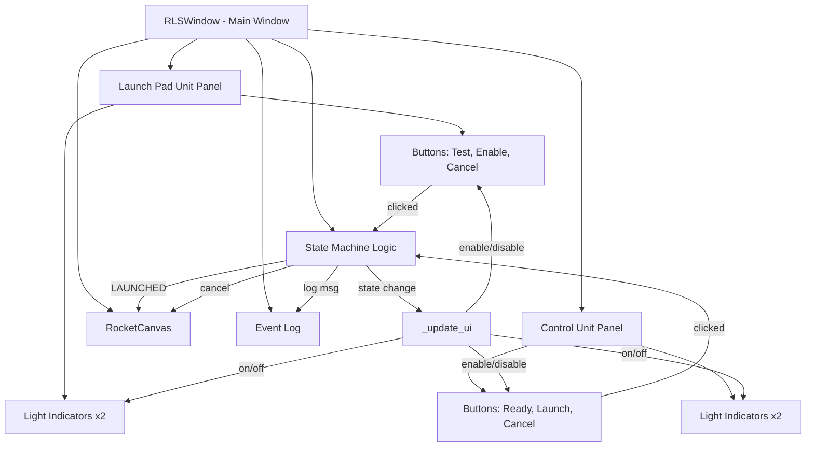
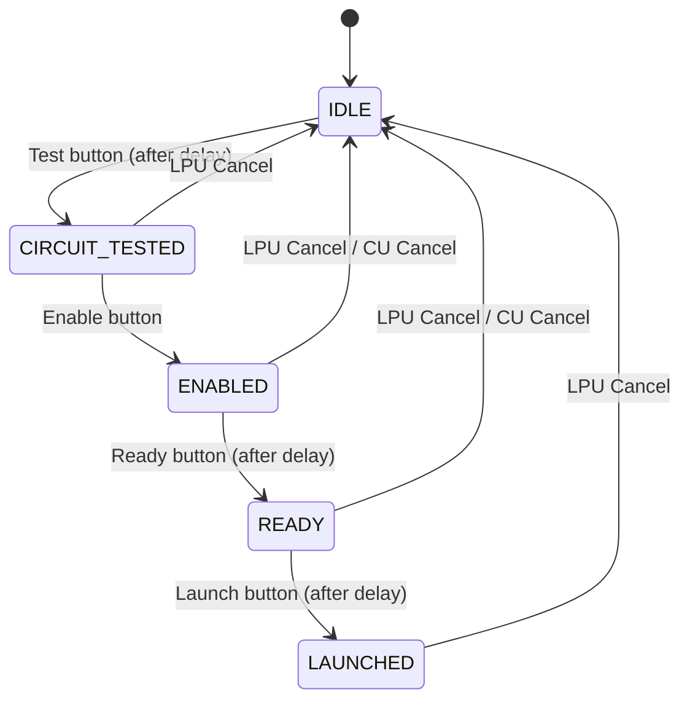

# Design Document — Rocket Launch System GUI Simulator

## Overview

The Rocket Launch System (RLS) GUI Simulator is a single-window Python desktop application built with PyQt6 that models a two-unit rocket launch system. The application simulates a Launch Pad Unit (LPU) and a Control Unit (CU) communicating wirelessly to safely test, arm, and launch a model rocket.

The core of the system is a deterministic finite state machine with five states: IDLE → CIRCUIT_TESTED → ENABLED → READY → LAUNCHED. The GUI enforces strict sequencing — buttons are only enabled when their corresponding transition is valid. Cancel from either unit resets the system to IDLE.

The application renders a rocket graphic on a starfield canvas with launch pad, animates the rocket upward with flame effects on successful ignition, and maintains a timestamped event log of all state transitions and button presses.

### Key Design Decisions

1. **Single-file architecture**: The entire application lives in one Python file (`rls_gui.py`) for simplicity and educational clarity. Classes are organized top-down: data model → widgets → main window.
2. **State machine as string enum**: States are defined as class-level string constants (not Python `enum.Enum`) for straightforward comparison and display in the UI label.
3. **QTimer-based communication delays**: Simulated wireless delays use `QTimer.singleShot()` to model asynchronous acknowledgments without threading.
4. **Tagged scene items for rocket**: Rocket graphic elements are tagged with `_is_rocket = True` so they can be selectively removed and redrawn during animation without clearing the starfield and launch pad.

## Architecture

The application follows a layered event-driven architecture:



### State Machine Diagram



### Architectural Layers

| Layer | Responsibility | Components |
|-------|---------------|------------|
| **Presentation** | Rendering widgets, handling paint events | `Light`, `RocketCanvas`, `make_panel()`, `make_button()` |
| **Controller** | Button click handlers, state transition logic, UI synchronization | `RLSWindow` methods (`_on_test`, `_on_enable`, etc.) |
| **Model** | State definition, transition rules | `State` class, `_state` field, `_update_ui` button-enable map |

## Components and Interfaces

### State (Class)

Defines the five system states as string constants.

```python
class State:
    IDLE            = "IDLE"
    CIRCUIT_TESTED  = "CIRCUIT_TESTED"
    ENABLED         = "ENABLED"
    READY           = "READY"
    LAUNCHED        = "LAUNCHED"
```

**Interface**: Read-only constants used for comparison (`self._state == State.IDLE`).

### Light (QWidget)

A circular indicator light with on/off state and a text label.

| Method | Signature | Description |
|--------|-----------|-------------|
| `__init__` | `(color_on: QColor, label: str, parent=None)` | Creates light with designated on-color and label text |
| `set_on` | `(on: bool) -> None` | Toggles the light on or off, updates visual |
| `is_on` | `@property -> bool` | Returns current on/off state |

**Visual behavior**:
- Off state: dim dark circle (`QColor(40, 40, 40)`) with `#555` border
- On state: bright circle in `color_on` with CSS glow effect
- Fixed size: 54×70 pixels (44×44 bulb + label)

### RocketCanvas (QGraphicsView)

Renders the starfield, launch pad, and rocket graphic. Handles launch animation.

| Method | Signature | Description |
|--------|-----------|-------------|
| `__init__` | `(parent=None)` | Sets up scene, draws initial starfield + rocket |
| `ignite` | `() -> None` | Starts launch animation (flame + upward movement) |
| `reset` | `() -> None` | Stops animation, returns rocket to pad |

**Internal state**:
- `_rocket_y: float` — vertical position of rocket body bottom (baseline: 220)
- `_flame_on: bool` — whether flame polygons are drawn
- `_launched: bool` — whether upward movement is active
- `_launch_vel: float` — current upward velocity (increases by 0.4 per frame)
- `_timer: QTimer` — fires every 40ms during animation

**Animation loop** (`_animate`):
1. Increment velocity by 0.4
2. Subtract velocity from `_rocket_y`
3. Redraw rocket with flame polygons
4. Stop when `_rocket_y < -150` (off-screen)

### RLSWindow (QMainWindow)

The main application window. Owns all widgets and the state machine.

| Method | Signature | Description |
|--------|-----------|-------------|
| `_build_ui` | `() -> None` | Constructs all panels, canvas, log, wires signals |
| `_on_test` | `() -> None` | Handles Test button; starts delay timer |
| `_test_current_detected` | `() -> None` | Callback after test delay; transitions to CIRCUIT_TESTED |
| `_on_enable` | `() -> None` | Handles Enable button; transitions to ENABLED |
| `_on_ready` | `() -> None` | Handles Ready button; starts delay timer |
| `_ready_acknowledged` | `() -> None` | Callback after ready delay; transitions to READY |
| `_on_launch` | `() -> None` | Handles Launch button; starts delay timer |
| `_launch_acknowledged` | `() -> None` | Callback after launch delay; transitions to LAUNCHED |
| `_on_cancel` | `() -> None` | Handles Cancel from either unit |
| `_reset` | `() -> None` | Resets state to IDLE, turns off all lights, resets canvas |
| `_update_ui` | `() -> None` | Enables/disables all buttons based on current state |
| `_log` | `(msg: str) -> None` | Appends timestamped message to event log |

### Helper Functions

| Function | Signature | Description |
|----------|-----------|-------------|
| `make_panel` | `(title: str, color: str) -> tuple[QFrame, QVBoxLayout]` | Creates a styled panel frame with title and separator |
| `make_button` | `(label: str, color: str) -> QPushButton` | Creates a styled button with hover and disabled states |

### Button-to-State Transition Map

| Button | Valid Source State | Target State | Delay |
|--------|------------------|--------------|-------|
| Test | IDLE | CIRCUIT_TESTED | 600ms |
| Enable | CIRCUIT_TESTED | ENABLED | None |
| Ready | ENABLED | READY | 400ms |
| Launch | READY | LAUNCHED | 500ms |
| LPU Cancel | Any except IDLE | IDLE | None |
| CU Cancel | ENABLED, READY | IDLE | None |

### Button Enable/Disable Matrix

| State | Test | Enable | LPU Cancel | Ready | Launch | CU Cancel |
|-------|------|--------|------------|-------|--------|-----------|
| IDLE | ✅ | ❌ | ❌ | ❌ | ❌ | ❌ |
| CIRCUIT_TESTED | ❌ | ✅ | ✅ | ❌ | ❌ | ❌ |
| ENABLED | ❌ | ❌ | ✅ | ✅ | ❌ | ✅ |
| READY | ❌ | ❌ | ✅ | ❌ | ✅ | ✅ |
| LAUNCHED | ❌ | ❌ | ✅ | ❌ | ❌ | ❌ |

### Light State Matrix

| State | LPU Green (TEST) | LPU Red (ENABLE) | CU Red (READY) | CU Green (LAUNCH) |
|-------|-------------------|-------------------|-----------------|---------------------|
| IDLE | Off | Off | Off | Off |
| CIRCUIT_TESTED | On | Off | Off | Off |
| ENABLED | On | On | Off | Off |
| READY | On | On | On | Off |
| LAUNCHED | On | On | On | On |

## Data Models

### State Machine Model

The state machine is represented as a single string field `_state` on `RLSWindow`. Valid states and transitions:

```python
VALID_TRANSITIONS = {
    "IDLE":            ["CIRCUIT_TESTED"],
    "CIRCUIT_TESTED":  ["ENABLED", "IDLE"],
    "ENABLED":         ["READY", "IDLE"],
    "READY":           ["LAUNCHED", "IDLE"],
    "LAUNCHED":        ["IDLE"],
}
```

### Light State Model

Each `Light` instance holds:
- `_color_on: QColor` — the bright color when on
- `_color_off: QColor` — always `QColor(40, 40, 40)`
- `_on: bool` — current state

### Rocket Animation Model

The `RocketCanvas` animation state:

```python
@dataclass
class RocketAnimState:
    rocket_y: float = 220.0      # vertical position (decreases during launch)
    flame_on: bool = False        # whether flame polygons render
    launched: bool = False        # whether upward movement is active
    launch_vel: float = 0.0       # current velocity (increases by 0.4/frame)
```

### Communication Delay Configuration

Delays are currently hardcoded as `QTimer.singleShot` arguments:

| Event | Delay (ms) |
|-------|-----------|
| Test circuit detection | 600 |
| Ready acknowledgment | 400 |
| Launch acknowledgment | 500 |

These could be extracted to a configuration dict for tunability:

```python
COMM_DELAYS = {
    "test_circuit": 600,
    "ready_ack": 400,
    "launch_ack": 500,
}
```


## Correctness Properties

*A property is a characteristic or behavior that should hold true across all valid executions of a system — essentially, a formal statement about what the system should do. Properties serve as the bridge between human-readable specifications and machine-verifiable correctness guarantees.*

### Property 1: State label reflects current state

*For any* valid state in {IDLE, CIRCUIT_TESTED, ENABLED, READY, LAUNCHED}, after `_update_ui()` is called, the state label text SHALL contain the current state's name string.

**Validates: Requirements 1.3**

### Property 2: Light toggle visual correctness

*For any* `Light` instance constructed with any `color_on` value, when `set_on(True)` is called the bulb background SHALL contain the `color_on` color, and when `set_on(False)` is called the bulb background SHALL be the dim dark color (`QColor(40, 40, 40)`).

**Validates: Requirements 4.1, 4.2**

### Property 3: Button enable/disable matrix correctness

*For any* state in {IDLE, CIRCUIT_TESTED, ENABLED, READY, LAUNCHED}, after `_update_ui()` is called, the enabled/disabled status of all six buttons (Test, Enable, LPU Cancel, Ready, Launch, CU Cancel) SHALL match the expected button-enable matrix defined in the design.

**Validates: Requirements 5.2, 5.3, 5.4, 6.4, 6.5, 7.3, 7.4, 8.4, 8.5, 9.5, 16.1**

### Property 4: Light state matrix correctness

*For any* state in {IDLE, CIRCUIT_TESTED, ENABLED, READY, LAUNCHED}, the on/off configuration of all four lights (LPU Green TEST, LPU Red ENABLE, CU Red READY, CU Green LAUNCH) SHALL match the expected light state matrix: IDLE = all off, CIRCUIT_TESTED = only LPU Green on, ENABLED = LPU Green + LPU Red on, READY = LPU Green + LPU Red + CU Red on, LAUNCHED = all on.

**Validates: Requirements 6.3, 7.2, 8.3, 9.3, 10.3**

### Property 5: State transition map correctness

*For any* state and any button press (Test, Enable, Ready, Launch, LPU Cancel, CU Cancel), the resulting state SHALL match the valid transition map. Specifically: buttons pressed in invalid states SHALL leave the state unchanged, and buttons pressed in valid states SHALL produce the expected target state.

**Validates: Requirements 6.2, 7.1, 8.2, 9.2, 10.1, 10.2, 11.1, 11.2, 11.3, 11.4**

### Property 6: Rocket stationary in pre-launch states

*For any* state in {IDLE, CIRCUIT_TESTED, ENABLED, READY}, the rocket canvas SHALL have `rocket_y` at the baseline position (220), `launched` SHALL be False, and `flame_on` SHALL be False.

**Validates: Requirements 13.4**

### Property 7: Rocket animation velocity is monotonically increasing

*For any* sequence of animation frames after `ignite()` is called, each frame's `launch_vel` SHALL be greater than the previous frame's `launch_vel`, and each frame's `rocket_y` SHALL be less than the previous frame's `rocket_y`.

**Validates: Requirements 14.2**

### Property 8: Rocket reset returns to initial state

*For any* animation state (any values of `rocket_y`, `launched`, `flame_on`, `launch_vel`), calling `reset()` SHALL return `rocket_y` to 220, `launched` to False, `flame_on` to False, and `launch_vel` to 0.0, and the animation timer SHALL be stopped.

**Validates: Requirements 14.4**

### Property 9: Event log grows on state transitions

*For any* valid state transition (including cancel), the event log entry count SHALL increase by at least one after the transition completes.

**Validates: Requirements 15.1, 15.2**

## Error Handling

### Invalid State Transitions

The state machine uses guard conditions (`if self._state == State.X`) on every button handler. If a button is pressed in an invalid state, the handler simply returns without modifying state. This is defense-in-depth — the UI also disables invalid buttons, but the state machine logic does not rely on the UI for safety.

### Timer Race Conditions

Delayed transitions (Test, Ready, Launch) re-check the current state in their callback. For example, `_test_current_detected` verifies `self._state == State.IDLE` before transitioning. This prevents stale timer callbacks from corrupting state if the user cancels during a delay.

### Cancel During Delay

If a user presses Cancel while a `QTimer.singleShot` is pending (e.g., after pressing Test but before the 600ms callback fires), the cancel handler immediately resets to IDLE. When the stale callback fires, its guard condition fails and it does nothing.

### Animation Edge Cases

- `reset()` explicitly stops the timer, resets all animation state, and redraws the full scene. This handles the case where reset is called mid-animation.
- The animation loop stops itself when `rocket_y < -150`, preventing infinite timer ticks after the rocket leaves the canvas.

### Light State Consistency

Lights are explicitly set in transition handlers and in `_reset()`. The `_reset()` method turns off all four lights, ensuring no stale light state persists after cancel.

## Testing Strategy

### Unit Tests (Example-Based)

Unit tests cover specific scenarios, initial conditions, and UI composition:

- **Initial state**: Verify `_state == State.IDLE` at construction, all lights off, correct buttons enabled/disabled
- **UI composition**: Verify all buttons, lights, canvas, and log widgets exist with correct properties
- **Layout**: Verify LPU on left, canvas in center, CU on right
- **Delay callbacks**: Verify that `_test_current_detected`, `_ready_acknowledged`, `_launch_acknowledged` produce correct transitions when called directly
- **Animation termination**: Verify timer stops when `rocket_y < -150`
- **Log read-only**: Verify `QTextEdit.isReadOnly()` returns True
- **Visual styling**: Verify disabled/enabled button stylesheets

### Property-Based Tests

Property-based tests use [Hypothesis](https://hypothesis.readthedocs.io/) to verify universal properties across generated inputs.

**Configuration**: Minimum 100 iterations per property test.

**Tag format**: `Feature: rocket-launch-system, Property {number}: {property_text}`

| Property | Generator Strategy | What's Verified |
|----------|-------------------|-----------------|
| P1: State label | `sampled_from(all_states)` | Label text contains state name |
| P2: Light toggle | `sampled_from(colors) × booleans()` | Bulb color matches on/off state |
| P3: Button matrix | `sampled_from(all_states)` | All 6 buttons match expected enable/disable |
| P4: Light matrix | `sampled_from(all_states)` | All 4 lights match expected on/off |
| P5: Transition map | `sampled_from(all_states) × sampled_from(all_buttons)` | Result state matches transition map |
| P6: Rocket stationary | `sampled_from(pre_launch_states)` | rocket_y=220, launched=False, flame_on=False |
| P7: Velocity increasing | `integers(min_value=2, max_value=50)` (frame count) | Each frame: vel increases, y decreases |
| P8: Rocket reset | `floats() × booleans() × booleans() × floats()` (animation state) | After reset: baseline values restored |
| P9: Log growth | `sampled_from(valid_transitions)` | Log entry count increases |

### Integration Tests

Integration tests verify timing and end-to-end flows:

- **Full launch sequence**: IDLE → Test → (delay) → CIRCUIT_TESTED → Enable → ENABLED → Ready → (delay) → READY → Launch → (delay) → LAUNCHED
- **Cancel during delay**: Press Test, then Cancel before 600ms, verify state returns to IDLE and stale callback is harmless
- **Cancel from each state**: Verify cancel from CIRCUIT_TESTED, ENABLED, READY, and LAUNCHED all reset correctly
- **Communication delays**: Verify transitions don't occur synchronously for Test, Ready, and Launch buttons
