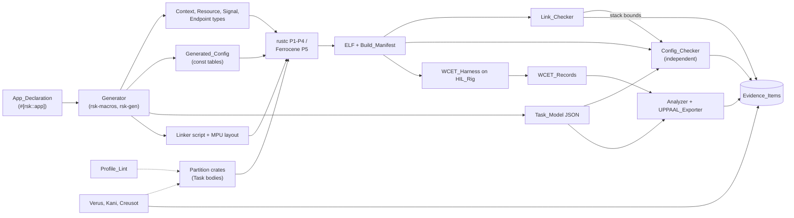
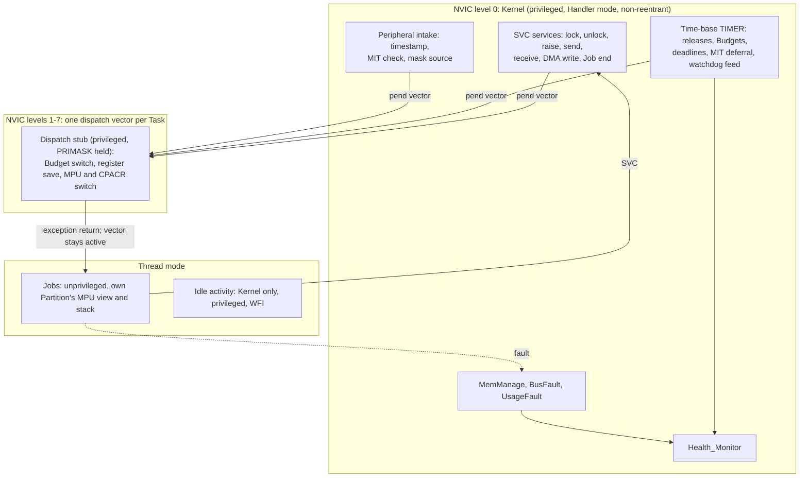
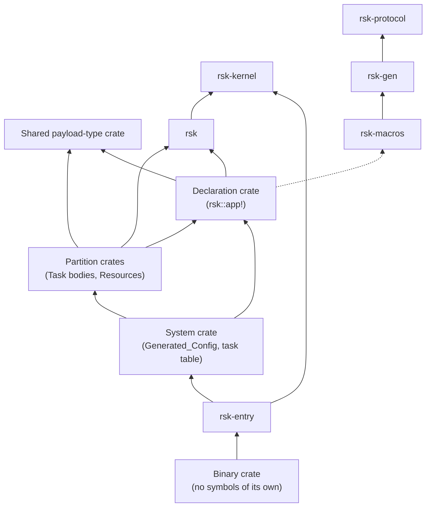

# Design Document

**rsk: a Ravenscar-Style Concurrency Profile for Rust**

Status: Draft 0.1 (design phase). Implements requirements.md Draft 0.2. Requirement references (Rn.m, PR-nn, ASM-nn, ORQ-nn, RN-nn, PAR-nn) point into requirements.md; design decisions are numbered DD-nn.

## Overview

rsk keeps RTIC's central idea: the Cortex-M interrupt controller is the scheduler, and the Stack Resource Policy (SRP) is implemented by priority masking. It changes three things that RTIC leaves to the user, because the requirements demand DO-178C-style robust partitioning and analyzable timing:

1. **Every Task body runs unprivileged.** The Kernel enters each Job through its own interrupt vector, as RTIC does, but then drops to unprivileged Thread mode with that vector still active. The NVIC therefore still enforces the SRP start condition in hardware, while the MPU confines each Partition to its own memory and peripherals (DD-01).
2. **The Kernel sits above every Ceiling.** One NVIC priority level is reserved for the Kernel: SVC, faults, the time-base timer, and peripheral-interrupt intake. Budget enforcement, MIT enforcement, and fault handling therefore work whatever the System_Ceiling (R18.2), and Kernel code never preempts itself, which keeps the verified Kernel sequential (DD-02).
3. **Everything that varies is generated and checked twice.** A proc-macro Generator turns one App_Declaration into Generated_Config, a JSON Task_Model, and a linker script. An independently written Config_Checker recomputes every derived value from the Task_Model and compares it with the linked binary (R26), so the Generator does not need TQL-1/TQL-2 qualification.

### Design decisions

| ID | Decision | Resolves | Main requirements |
|---|---|---|---|
| DD-01 | Hardware SRP dispatch with unprivileged Thread-mode Jobs: each Task has a dispatch vector (the NVIC pending bits are the ready queue and NVIC arbitration selects the Job); its Kernel stub returns to unprivileged Thread mode, which deactivates the vector, and the Kernel holds BASEPRI at the executing Job's level or the System_Ceiling, whichever is higher; locks are SVC calls that raise BASEPRI; Job end unwinds the stub's level record. *Revised 2026-10-08 by the P1 spike: the original "vector still active (NONBASETHRDENA)" form is impossible, see "Running Jobs unprivileged".* | ORQ-01, ORQ-28 | R7, R8, R16, R20 |
| DD-02 | One Kernel-reserved NVIC level (the most urgent). SVC, MemManage, BusFault, UsageFault, the time-base TIMER, and peripheral intake run there; Tasks use the remaining 7 levels. Kernel code is non-reentrant. | R18.2 decision, ORQ-23 | PR-33, R7.4, R18, R19, R22.2 |
| DD-03 | Equal-priority order is the NVIC's fixed exception-number order, assigned by the Generator in declaration order; no FIFO emulation. | ORQ-17 | R4.3, R4.6, R7.3 |
| DD-04 | Eager floating-point stacking (FPCCR.ASPEN = 1, LSPEN = 0); FPDSCR supplies the per-Job FP control settings. | ORQ-16 | R11 |
| DD-05 | Kernel time base on a TIMER peripheral clocked from HFCLK at 16 MHz, extended to 64 bits in software; timed events live in a static slot table, one slot per declared event. | ASM-16, ASM-19 | R9, R13 |
| DD-06 | Peripheral interrupts are Kernel intake handlers that timestamp, apply MIT enforcement, mask the source for the rest of the MIT window, and pend the Task's dispatch vector. | ORQ-23 | R10, R19 |
| DD-07 | One MPU layout per Partition: shared code, Partition code, Partition RAM (stack at the bottom, so overflow faults), and up to five peripheral windows; the Kernel uses the privileged background map. | ORQ-02 | R16, R20.4, R37 |
| DD-08 | EasyDMA-capable peripherals are mapped read-only to their Partition; writes go through a Kernel service that validates DMA pointer and length registers; EasyDMA list mode is forbidden; PPI is Kernel-owned and configured at Init. | ORQ-03 | R17 |
| DD-09 | Endpoint buffers are Kernel-owned and operated inside SVC at the Kernel level, so their effective Ceiling is the Kernel level; payloads are copied. | ORQ-11 (partly) | R39, R40, R42 |
| DD-10 | Closed response sets: END_JOB, RESTART_PARTITION, STOP_PARTITION, SAFE_STATE, RECORD_ONLY (deadline misses only), RECORD_AND_CONTINUE (Overruns of highest-criticality Partitions only). | — | R14.5, R15.1, R18.5 |
| DD-11 | One crate per Partition; a generated linker script places each Partition crate's sections; Applications contain no link-level attributes; the Kernel's `rsk-entry` crate binds vectors. | — | PR-20, R6.3, R24.2 |
| DD-12 | Precise BusFaults: ACTLR.DISDEFWBUF = 1 for Kernel accesses and Strongly-ordered MPU attributes for Partition peripheral windows. | ORQ-27 | R14.3 |
| DD-13 | App_Prover: Creusot; Analyzer core and Kernel proved in Verus; Kani for the Kernel_Unsafe_Module and cross-checks. | ORQ-10 | R44–R46, R32.1 |

The rest of this document follows the deliverables of the request: architecture and data flow, module boundaries, key types, the ceiling-protocol state machine, the verification plan and trust-base analysis, and the comparison with Ravenscar and RTIC. Each section names the requirements it implements. Assumptions and open questions stay in requirements.md; the dispositions are in "Open Research Question Dispositions".

## Architecture

### Build-time data flow

One App_Declaration feeds every artefact. Each artefact that reaches the Analyzer is first checked against the linked binary (R24, R25, R26, R28.8).



### Runtime structure



### Priority and privilege model (DD-01, DD-02)

The nRF52840 implements 3 NVIC priority bits (PAR-06, ASM-03). The Kernel sets PRIGROUP so that all three bits are preemption bits and uses this map:

| NVIC level | Encoding | Used by |
|---|---|---|
| 0 | 0x00 | Kernel: SVC, MemManage, BusFault, UsageFault, time-base TIMER, peripheral intake, Kernel-owned interrupts |
| 1–7 | (8 − p) << 5 | Dispatch vector of each Task of Priority p (p = 7 is the most urgent) |
| base | — | Idle activity (Thread mode, no active exception) |

Ceiling c maps to BASEPRI = (8 − c) << 5, and the idle level maps to BASEPRI = 0. Even a Ceiling of 7 masks only Task vectors, never the Kernel, which is how R18.2 holds. These are the Kernel-reserved levels of PR-33, so an Application has at most 7 distinct Task Priorities (R22.2).

Each Task owns one dispatch vector: an EGU/SWI line or an unused peripheral interrupt line, which the Kernel pends through NVIC ISPR. The NVIC takes a pending vector only if its priority is strictly higher than the execution priority, which is the maximum over the active exceptions and BASEPRI. That is the R7.1 start condition, so dispatch stays in hardware as in RTIC [RN-03, RN-07]. The pending bit gives each Task at most one pending Release (PR-12, R9.7). The Generator rejects an Application that needs more dispatch vectors than the Target has free interrupt lines. Equal-priority vectors are taken in exception-number order (DD-03).

**Running Jobs unprivileged.** On Armv7-M, Handler mode is always privileged [RN-30], so a Job must execute in Thread mode. The original DD-01 text assumed that, with CCR.NONBASETHRDENA = 1, the dispatch stub could return to Thread mode *with its own vector still active*, so that the NVIC alone would enforce SRP during the Job. **The P1 spike (task 3.1, 2026-10-08, QEMU mps2-an386 Cortex-M4) showed this is not what the architecture does**: `ExceptionReturn` always deactivates the returning exception (Armv7-M ARM B1.5.8, `DeActivate(ReturningExceptionNumber)`); NONBASETHRDENA only permits a return to Thread mode while *other* exceptions remain active. With the original stubs every Job ran at the base level, lower-priority dispatch vectors preempted Jobs holding Resources, and a second defect hid the first: the `cbnz r0, rsk_hop` cross-section branch of the SVC stub has no relocation and the assembler silently emitted a `nop`, so the two-step return never executed (recorded as ORQ-32).

DD-01 as revised keeps the hardware dispatch (pending bits as the ready queue, NVIC arbitration as the selection, per-Task vectors at the Task's level) and enforces the *executing* Job's level in software: the Kernel keeps BASEPRI = encode(max(Priority of the executing Job, System_Ceiling)), set at every dispatch, lock, unlock and Job end. The Kernel level (priority 0) is never masked (`uj_010_basepri_never_masks_kernel_level`). No exception is active while a Job executes, so NONBASETHRDENA stays 0 and the Armv8-M concern of ORQ-19 is moot. Job end no longer needs a fake Handler-mode frame: the SVC (or timer, intake, fault) handler that ends the Job pops its own pushes and enters `rsk_unwind`, which restores the preempted context from the level record (PSP, CONTROL, EXC_RETURN, MPU view, BASEPRI), pops the R3-R11/LR record that the dispatch stub left on the MSP, and performs the handler's own exception return with the preempted context's EXC_RETURN; a killed resumed Job is ended in the same loop one level further down. The Partition stack floor is updated from the preempted Job's live PSP at every dispatch (the spike also found the floor being taken from the Job's *initial* frame, which let a same-Partition Job overwrite the preempted Job's stack). The spike's dispatch tests, MPU view switching between two Partitions, SVC lock/unlock with a Ceiling that blocks a higher-Priority Release, eager FP stacking and the operating-duration end pass on QEMU (`cargo xtask qemu`, `apps/p1-demo`); the HIL register-pattern and privilege-fault cases remain for task 3.3/7.x on hardware. The Hardware_Model states both halves of the exception-return rule (HW-07).

```mermaid
sequenceDiagram
    participant A as Job A (Priority a, Thread)
    participant N as NVIC
    participant S as Stub B (level b, Handler)
    participant B as Job B (Priority b > a, Thread)
    participant K as Kernel (level 0, SVC)
    N->>S: take vector B (b above BASEPRI = max(a, System_Ceiling))
    Note over A,N: hardware stacks A's frame (extended if A's FP context is active) on A's PSP
    S->>S: PRIMASK on; charge A's elapsed cycles; save A's PSP, CONTROL, EXC_RETURN in the level-b record; push A's R3-R11, LR (and S16-S31) on the MSP
    S->>S: A's live PSP becomes its Partition's stack floor; load B's Partition MPU regions; BASEPRI = max(b, System_Ceiling); arm the next compare
    S->>B: write B's initial frame below the floor of B's Partition stack; CONTROL.nPRIV = 1; exception return to Thread mode (vector B deactivated)
    B->>K: SVC lock(r) / unlock(r): BASEPRI raised to the Ceiling, then back to max(level, Ceiling)
    B->>K: SVC job-end (the Task body returned into the trampoline)
    K->>K: job_return; pop the SVC stub's pushes; rsk_unwind(level b)
    K->>K: PRIMASK on; restore A's MPU view, BASEPRI = max(a, Ceiling), floor; pop A's R3-R11, LR (and S16-S31) from the MSP; PSP = A's PSP; CONTROL = A's
    K->>A: the SVC's exception return with A's saved EXC_RETURN (A's frame unstacked from A's PSP)
```

If the Health_Monitor killed A while B was in progress, `rsk_unwind` ends A as well (its level record is next on the MSP) and continues to the context A preempted; a response that ends the executing Job from the timer, intake or fault handler enters `rsk_unwind` the same way.

Exception entry does not stack CONTROL or R4–R11. The Kernel therefore keeps CONTROL, PSP and EXC_RETURN in a per-level record, a static array of 7 entries, since at most one Job per level is in progress, and leaves R3–R11/LR (and S16–S31) of the preempted context on the MSP, where the LIFO order of Jobs (Property 2) makes the record of the Job being ended always the MSP top once the ending handler has popped its own pushes. It restores them before each return to the preempted context. This keeps the preempted Job intact when the Health_Monitor ends Job B part-way through a function (R8.9, R14). It also stops a misbehaving Job from corrupting the registers of the Job it preempted. Stub work runs with PRIMASK held, so Kernel state is never touched concurrently. That work is bounded by L_kernel and is part of Δ_dispatch and Δ_complete. Tail-chaining and late arrival need no special handling: each stub reads the actual EXC_RETURN and PSP it was entered with.

**Locks.** Unprivileged code cannot write BASEPRI, so `lock` and `unlock` are SVC calls. The SVC handler checks the Resource identifier against the calling Task's declared Resources in Generated_Config. It then writes BASEPRI with BASEPRI_MAX semantics, so the value only rises, and pushes the previous value on the Job's lock stack. The stack's depth is at most the number of the Task's Resources (R8.10). Each lock costs an SVC round trip, against RTIC's inline BASEPRI write. Δ_lock_in and Δ_lock_out are measured in P3. A privileged fast path for the highest Criticality_Level (ORQ-01 option c) is a later optimization.

### Interrupt intake and MIT enforcement (DD-06)

Every peripheral interrupt line bound to a Task runs at level 0 as a Kernel intake handler; the Task itself runs on its dispatch vector. On each event, the intake handler:

1. reads the time base and records the event instant; the lag from the hardware event is Δ_stamp;
2. masks the line in the NVIC;
3. if R10.1 accepts the event, pends the Task's dispatch vector and starts the MIT window;
4. re-enables the line at the later of the end of the MIT window and the end of the Job.

While the line is masked, further events stay latched in the peripheral and are delivered when the line is re-enabled. These sources therefore have the "coalesced and deferred" behaviour of R19.4, and the Generator rejects the discard policy for them. Each source costs at most one intake per MIT window, which gives R19.1's ⌈t / MIT⌉ · Δ_irq bound. The Task's own code clears the peripheral event, which is why re-enabling waits for the Job to end. Release_Signal and Endpoint sources have no hardware line. Their MIT checks run in the SVC that raises or sends, and they support both deferral and discard (R10.2).

### Memory and MPU layout (DD-07, DD-11)

| Region | Contents | Unprivileged access |
|---|---|---|
| Kernel flash, Generated_Config | Vector table, Kernel code, constant configuration (R24.6) | none (background map, privileged only) |
| Shared code | `core`, `rsk` API, Endpoint typestate code; no writable statics (Link_Checker) | read and execute, all Partitions |
| Partition code (one per Partition) | The Partition crate's `.text` and `.rodata` | read and execute, own Partition |
| Partition RAM (one per Partition) | Stack at the lowest address, then `.data`, `.bss`, Resources, DMA buffers, Init_Arena | read and write, execute never, own Partition |
| Peripheral windows (up to 5) | 4 KB blocks of owned peripherals, grouped with subregions | Strongly-ordered; read-only for EasyDMA-capable peripherals (DD-08) |
| Kernel RAM, Endpoint storage | Kernel state, MSP stack, Endpoint buffers | none |

With PRIVDEFENA = 1, the Kernel runs on the background map, so the eight MPU regions all serve the running Partition. Each Partition stack sits at the bottom of its RAM region, so an overflow leaves the region and faults before it modifies anything else (R16.5). This needs no guard region. Partition RAM regions are power-of-two sized and aligned. The Generator places them largest first and trims waste with subregion disables. It rejects layouts that do not fit (R20.4). Arranging all of this at link time is the reason for one crate per Partition (DD-11). The generated linker script places each Partition crate's input sections by archive name. Application crates can then keep `#![forbid(unsafe_code)]`, which the `unsafe_code` lint enforces by also rejecting `no_mangle`, `export_name`, and `link_section` (the attributes Rust 2024 marks unsafe, [Edition Guide](https://doc.rust-lang.org/edition-guide/rust-2024/unsafe-attributes.html)). The vector table and reset entry live in the Kernel-owned `rsk-entry` crate. That crate reaches the project's system crate through a path dependency (or a Cargo `[patch]` entry) that the Build_System sets up in the vendored source tree (R58.1). The Application therefore never defines a link-level symbol. This arrangement is validated in the P1 build spike (see Requirements Impact).

**Fallback (exercised).** The spike's outcome was the partial fallback described above rather than ORQ-01 option (b) (PendSV switch and software SRP): dispatch and selection stay in the NVIC, only the executing Job's level moved to BASEPRI. As anticipated, the change touched Kernel_Arch alone: the verified Kernel logic emits the same abstract actions ("pend vector", "set ceiling", "load Partition view") and its proofs were unchanged (208 items verified before and after).

## Components and Interfaces

### Module boundaries

| Crate | Kind | Contents | `unsafe` | Primary evidence |
|---|---|---|---|---|
| `rsk-kernel` | `no_std` lib | `logic` (portable state machine inside `verus!`), `hw_model` (Verus specs), `arch` (Kernel_Arch trait), `arch::cm4` and its `unsafe_module` (Kernel_Unsafe_Module: assembly, register access, SVC entry and exit, dispatch stubs) | `unsafe_module` only | Verus (logic), Kani (unsafe_module), HIL differential tests |
| `rsk-entry` | `no_std` lib | Vector table, reset entry, `HardFault`; references the project's system crate | all (part of the Kernel_Unsafe_Module) | Review against a fixed template, Link_Checker |
| `rsk` | `no_std` lib | Application API: Context types, `Mutex`, `Signal`, `now()`, Endpoint glue; safe wrappers over Kernel SVC stubs | forbidden | Kani (glue), Creusot contracts for App proofs |
| `rsk-macros` | proc-macro | `rsk::app!` front end; delegates to `rsk-gen` | forbidden | trybuild compile-fail suite |
| `rsk-gen` | host lib + CLI | Generator core: validation, Ceilings, capacities, MPU layout, linker script, Task_Model printer | forbidden | proptest; outputs re-checked by the Config_Checker |
| `rsk-model` | host lib | Task_Model, WCET_Record, and timing schemas (serde types plus JSON Schema files) | forbidden | Round-trip tests (R25.5, R33.2) |
| `rsk-protocol` | host lib | Protocol_Checker: projection, k-multiparty compatibility, bound k | forbidden | proptest; differential runs against Rumpsteak's k-MC checker |
| `rsk-lint` | Dylint library + `clippy.toml` | Profile_Lint | n/a | UI tests |
| `rsk-link` | host CLI | Link_Checker: symbols, call graph, stack bounds, instruction-class scans, dependency and allocator checks | forbidden | Fixture binaries |
| `rsk-confcheck` | host CLI | Config_Checker; depends only on a JSON parser and an ELF reader, not on `rsk-model` or `rsk-gen` (R26.1) | forbidden | Mutation suite (R26.7) |
| `rsk-analyzer` | host CLI | RTA (core in `verus!`), UPPAAL_Exporter, reports | forbidden | Verus (core), proptest, simulator, literature task sets |
| `rsk-wcet` | host CLI + target agent | WCET_Harness on probe-rs | forbidden | HIL runs |
| `rsk-hil` | host scripts | HIL_Rig orchestration, fault injection, Hardware_Model differential tests | n/a | Test reports |



### App_Declaration and generation pipeline (Component C)

The App_Declaration is written once, in a declaration crate, with the `rsk::app!` macro. Its syntax follows RTIC's attribute style [RN-06], and its content follows Hubris' whole-system manifest: every Partition, Task, Resource, Release_Signal, Endpoint, peripheral, and memory budget is declared up front [RN-09].

```rust
rsk::app! {
    target = nrf52840, profile = Ravenscar, operating_duration = 10.h(), safe_state = app_types::safe_outputs;

    partition nav (level = A, code = 64.KiB(), ram = 16.KiB(), stack = 4.KiB(),
                   fault = RESTART_PARTITION, overrun = RECORD_AND_CONTINUE,
                   deadline_miss = RECORD_ONLY, mit_threshold = 10) {
        peripherals = [SPIM0, GPIOTE];
        resource state: nav::State = nav::State::new();
        task control (periodic, period = 10.ms(), offset = 0.ms(), deadline = 10.ms(),
                      budget = 120.us(), priority = 5, fpu, resources = [state],
                      endpoints = [telemetry.nav]);
        task imu (sporadic, binds = GPIOTE, mit = 1.ms(), mit_policy = defer,
                  deadline = 1.ms(), budget = 40.us(), priority = 6, resources = [state]);
    }
    partition log (level = C, /* ... */) { /* ... */ }

    endpoint telemetry: protocol app_types::Telemetry { nav => nav.control, log => log.sink }, capacity = 4;
}
```

One declaration produces three expansions and one CLI run:

| Step | Runs in | Produces |
|---|---|---|
| `rsk::app!` in the declaration crate | proc-macro | Validation (R21, R22); exported `macro_rules!` manifests for each Partition and for the system crate; shared Release_Signal and Endpoint role types |
| `app_decl::rsk_partition_nav!()` in each Partition crate | `macro_rules!` | Resource cells, Context types, Task signature checks; the statics land in the Partition crate's archive, so the linker script can place them |
| `app_decl::rsk_system!()` in the system crate | `macro_rules!` | `pub static CONFIG: rsk::Config`: task table with entry functions, vectors, Ceilings, capacities, Budget and MIT tables, MPU views, Health_Monitor policy, checksum (R24.1) |
| `rsk-gen` CLI, run by the Build_System on the same declaration source | host | Task_Model JSON (R25), linker script, MPU layout report, configuration summary (R24.3) |

The proc-macro writes no files, so builds stay hermetic and reproducible (R59). The CLI and the macro share the `rsk-gen` library. Any divergence between the two shows up when the Config_Checker compares the Task_Model with the binary (R26.2).

### Kernel logic and Kernel_Arch (Component B)

The Kernel is a sequential state machine driven by five entry points: dispatch stub entry and exit, SVC, timer event, peripheral intake, and fault. All of them run at level 0 or with PRIMASK held. Verus proves each transition against the invariant and the Hardware_Model (R44). The logic emits abstract actions, and Kernel_Arch applies them to the hardware.

```rust
verus! {
pub struct Priority(pub u8);   // 1..=7, 7 most urgent
pub struct Ceiling(pub u8);    // 0 = idle level, 1..=7
pub struct Instant(pub u64);   // time-base ticks, 16 MHz, never wraps in practice (DD-05)
pub struct TaskId(pub u8);
pub struct PartitionId(pub u8);
pub struct ResourceId(pub u16);

pub enum JobPhase { Idle, Deferred(Instant), Pending, InProgress { level: u8 } }

pub enum Action {
    Pend(TaskId), SetCeiling(Ceiling), LoadView(PartitionId), ArmCompare(Instant),
    MaskIrq(u8), UnmaskIrq(u8), StopDma(PartitionId), EndJob(TaskId), SafeState,
}

pub struct KernelState<const NT: usize, const NP: usize, const NS: usize, const NL: usize> {
    pub jobs: [JobPhase; NT],
    pub level_owner: [Option<TaskId>; 8],   // Job in progress at each NVIC level
    pub ceiling: Ceiling,                     // mirror of BASEPRI
    pub locks: LockStack<NL>,                 // (ResourceId, previous Ceiling), LIFO (R8.6)
    pub slots: [Option<Instant>; NS],         // timed-event slot table (R9.4)
    pub mit: [MitState; NT],
    pub budget: [BudgetState; NT],
    pub partitions: [PartitionState; NP],
    pub log: EventLog,
}

impl<const NT: usize, const NP: usize, const NS: usize, const NL: usize> KernelState<NT, NP, NS, NL> {
    pub open spec fn inv(&self, cfg: &Config) -> bool { /* SRP, lock-stack, slot, and MIT invariants */ }

    pub fn lock(&mut self, cfg: &Config, t: TaskId, r: ResourceId) -> (out: Result<Action, Fault>)
        requires old(self).inv(cfg), old(self).running(t)
        ensures self.inv(cfg),
                out.is_ok() ==> self.ceiling == max(old(self).ceiling, cfg.ceiling(r)),
                out.is_err() ==> !cfg.may_access(t, r);
    // unlock, job_end, timer_event, intake, raise, send, receive, fault: same pattern
}
}

pub trait KernelArch {
    fn now(&self) -> Instant;        // spec: monotone, matches the Hardware_Model time base
    fn cycles(&self) -> u32;         // DWT CYCCNT
    fn apply(&mut self, a: Action);  // spec: the Hardware_Model step that `a` denotes
}
```

`arch::cm4` implements `KernelArch`. Everything that touches registers is inside `unsafe_module`, as functions with trusted specifications listed in the Trust_Base_Register (R44.5). These are the dispatch stubs, the SVC entry, the exception-return paths, MPU loads, and BASEPRI writes. Each `unsafe` block, `unsafe fn`, and `unsafe impl` carries a justification identifier. The identifier links to a Kani harness or a Verus proof or lemma where one is feasible, and otherwise to a recorded review that states why none is (R6.4, R45.1). Before every exception return, the Kernel executes a DSB, the workaround for Cortex-M4 erratum 838869 on stores overlapping exception return. The workaround's applicability to r0p1 is confirmed in the Hardware_Model errata review (ASM-01, R11.6).

### Application API (`rsk`)

```rust
pub trait Mutex {
    type T;
    fn lock<R>(&mut self, f: impl FnOnce(&mut Self::T) -> R) -> R;   // shape reused from RTIC
}

// Generated per Task: one proxy per declared Resource, and nothing else (R8.7).
pub mod task_control {
    pub struct Context<'a> {
        pub state: rsk::Shared<'a, crate::State, rsk::Tok<Control>>,
        pub telemetry: rsk::RoleSlot<'a, app_types::telemetry::Nav>,
    }
}

pub fn control(mut cx: task_control::Context<'_>) {   // synchronous: no async (PR-09)
    cx.state.lock(|s| s.update());                     // `&mut State` cannot escape the closure (R8.6)
}
```

- **Re-entry is a type error (R8.10).** `lock` takes `&mut self`, and the Context holds one proxy per Resource, so nested locking of the same Resource does not borrow-check.
- **Data-race freedom.** `ResourceCell<T>` is `Sync` only through an `unsafe impl` in the Kernel_Unsafe_Module. Its justification identifier cites the mutual-exclusion proof of R8.3 (R6.4, R45.1).
- **No waiting inside a Critical_Section (PR-08).** The closure receives `&mut T` only. Endpoint and Signal operations never wait (R40.4), and returning from the closure cannot end the Job.
- **Time (PR-24, PR-26).** `rsk::now()` returns the monotonic time base. The API has no timer, delay, or wall-clock operation.

### Endpoint_Library and Protocol_Checker (Component F)

Protocols are written as global types in the shared payload-type crate, in a Rumpsteak-like syntax [RN-22]. The Protocol_Checker projects each global type onto its roles and runs a bounded k-multiparty compatibility check. It accepts the Protocol only if the check succeeds for some k no larger than the declared capacity (R41.1). The Generator then emits a typestate API per role:

```rust
pub struct Nav<S>(PhantomData<S>);                       // zero-sized; the state is the type
impl Nav<S0> { pub fn send_fix(self, m: Fix) -> Result<Nav<S1>, (Nav<S0>, SendError)>; }
impl Nav<S1> { pub fn try_recv_ack(self) -> Result<(Ack, Nav<S0>), Nav<S1>>; }  // Err: buffer empty
pub enum NavState { S0(Nav<S0>), S1(Nav<S1>) }           // kept in the Task's RoleSlot between Jobs (R38.7)
```

A Job takes its role state out of its `RoleSlot`, which is static per-Task state (PR-25). It advances through the typed states and stores the result back before returning. Within a Job, every illegal operation is a type error (R38.4). Across Jobs, the enum keeps the state exact. If a Job returns with its slot empty, or drops a role value outside an end state, the generated Job wrapper reports a protocol violation to the Health_Monitor (R41.2). That is the run-time half of the affine-types gap noted in ORQ-11.

Sends and receives are SVC services that copy the payload into or out of Kernel-owned buffers at level 0 (DD-09, R42.2). Payload sizes are bounded by the declaration, so each operation has a WCET_Record. Cross-partition payload types must implement the `rsk::Plain` trait. The trait is derivable only for types that contain no references, pointers, or interior mutability and for which every bit pattern is valid (R42.1). It follows the zerocopy `FromBytes` pattern.

### Analyzer, Profile_Lint, Link_Checker, Config_Checker, WCET_Harness

- **Analyzer (Component D).** Implements R29 directly with `u64` cycle arithmetic. The fixed-point loop and its termination argument live inside `verus!` (R32.1). The UPPAAL_Exporter emits one task automaton per Task, a fixed-priority SRP scheduler automaton with Ceilings, release generators with jitter, and Kernel-overhead locations. It follows published UPPAAL schedulability frameworks [RN-24], and the query is `A[] not deadline_miss`.
- **Profile_Lint.** Stable Clippy configuration (`disallowed-methods`, `disallowed-types`, `disallowed-macros`) covers the deny-lists of PR-10, PR-11, PR-22, and PR-35. Dylint libraries cover the structural rules: async in Task bodies (PR-09), unlabelled or unbounded loops (PR-16), and the Core_Subset allow-list (PR-21). Dylint needs a nightly compiler, so the Profile_Lint is a verification aid listed in the Trust_Base_Register. Every rule with an LK category is backed by a binary-level check.
- **Loop bounds (R35).** Attributes on expressions are unstable, so bounds are stated per function on labelled loops: `#[rsk::bounds('scan = 16, 'retry = 3)] fn f() { 'scan: for .. {} }`. In instrumented builds, the attribute inserts iteration counters (R35.4). In every build, it exports the bounds with their source locations (R35.3).
- **Link_Checker.** Reads the ELF with the `object` crate. It decodes the Thumb-2 instructions that affect SP or control flow to build the call graph and per-function stack effects (PR-17, PR-18, R37). It scans instruction classes (PR-22, PR-31) and checks the Kernel crates' symbols against the template. Its call-graph results are differential-tested against `cargo-call-stack` on nightly builds.
- **Config_Checker.** A separate implementation (R26.1). It reads the Task_Model JSON and the ELF, recomputes the values of R26.2, and compares them with the `CONFIG` bytes extracted from the binary (R26.4).
- **WCET_Harness (Component E).** Budget accounting already measures every Job's execution cycles in Flight_Builds. The Kernel keeps a per-Task maximum, which the harness reads over probe-rs, so Task-entry measurement needs no extra instrumentation (R34.7). Measurement builds add CYCCNT reads around lock closures, Endpoint operations, and Kernel operations, with the read cost calibrated on the Target (R34.3). A second nRF52840-DK generates interrupt stimuli for MIT and storm scenarios (R19.3, R34.5).

## Data Models

### Generated_Config

```rust
pub struct Config {
    pub profile: ProfileId,                       // Profile version and variant (R6.7)
    pub tasks: &'static [TaskCfg],
    pub resources: &'static [ResourceCfg],        // Ceiling, owner Partition, accessor set
    pub signals: &'static [SignalCfg],
    pub endpoints: &'static [EndpointCfg],        // capacity, payload size, roles, Ceiling = Kernel level
    pub partitions: &'static [PartitionCfg],      // level, MPU view (8 RBAR/RASR pairs), stack top, responses
    pub slots: &'static [SlotCfg],                // timed events by the R9.4 rule
    pub irq: &'static [IrqCfg],                   // line, intake or Kernel-owned, bound Task
    pub dma: &'static [DmaCfg],                   // pointer and length register offsets, permitted buffers (DD-08)
    pub expected_target: TargetCfg,               // values checked at boot (R12.1)
    pub fp: FpCfg,                                // FPDSCR settings (R11.8)
    pub safe_state: SafeStateCfg,
    pub operating_duration: u64,                  // ticks (R9.9)
    pub checksum: u32,                            // CRC-32 over the tables above (R12.3)
}

pub struct TaskCfg {
    pub entry: fn(),                 // Job wrapper generated in the Partition crate
    pub vector: u8, pub priority: u8, pub partition: u8,
    pub kind: Kind,                  // Periodic { offset, period } | Sporadic { mit, policy, source }
    pub deadline: u64, pub budget_cycles: u32, pub fpu: bool,
    pub resources: &'static [u16],   // declared accessors (R8.7, checked again in SVC lock)
}
```

`CONFIG` is constant data in Kernel flash. Nothing writes it after link time (R24.6).

### Task_Model (excerpt)

```json
{
  "schema": "rsk-task-model/1",
  "profile": {"version": "0.2", "variant": "Ravenscar"},
  "generator": "0.1.0", "kernel": "0.1.0", "target": "nrf52840", "core_revision": "r0p1",
  "clock": {"cpu_hz": 64000000, "tick_hz": 16000000},
  "config_checksum": "0x5c1f3a90",
  "kernel_levels": [0],
  "partitions": [{"id": "nav", "level": "A", "fault": "RESTART_PARTITION", "overrun": "RECORD_AND_CONTINUE",
                  "deadline_miss": "RECORD_ONLY", "mit_threshold": 10,
                  "regions": {"code": 65536, "ram": 16384, "stack": 4096}}],
  "tasks": [{"id": "nav.control", "core": 0, "partition": "nav", "priority": 5, "vector": 21,
             "kind": "periodic", "offset_ticks": 0, "period_ticks": 160000, "deadline_ticks": 160000,
             "budget_cycles": 7680, "fpu": true, "resources": ["nav.state"],
             "cs_sites": ["nav.control#cs0"], "endpoint_roles": ["telemetry.nav"]}],
  "resources": [{"id": "nav.state", "core": 0, "partition": "nav", "ceiling": 6, "derived": ["ceiling"]}],
  "endpoints": [{"id": "telemetry", "cores": [0, 0], "capacity": 4, "k": 2, "ceiling": "kernel",
                 "payload_bytes": 32}],
  "slots": {"count": 9, "derived": true}
}
```

Every derived value carries `"derived"` markers (R23.5). Times are integers with their units in the field name (R25.4). Keys are emitted in canonical order.

### WCET_Record (excerpt)

```json
{"schema": "rsk-wcet/1", "item": "nav.control#cs0", "wcet_cycles": 912, "method": "measured",
 "tool": "rsk-wcet 0.1.0", "binary_hash": "sha256:…", "target": "nrf52840/r0p1",
 "clock_hz": 64000000, "icache": "off",
 "measured": {"runs": 10000, "max_observed": 760, "margin": 0.2, "coverage_branch": 0.97,
              "scenarios": ["dma-max", "fp-active", "preempt-max"]}}
```

### Kernel_Timing_Parameters added by this design (R13.6)

| Symbol | Bound on |
|---|---|
| Δ_svc | SVC entry plus exit with no service work; part of every SVC-based operation |
| Δ_dma_write | One Kernel-mediated register write to an EasyDMA-capable peripheral, including validation (DD-08) |
| Δ_view | Loading one Partition's MPU view (8 regions); included in Δ_dispatch and Δ_complete, and exported separately for review |

### Health_Monitor event log entry

`{ seq: u32, instant: u64, kind: EventKind, task: Option<TaskId>, partition: Option<PartitionId>, prs: PrSet, detail: u32 }`, where `prs` is a bit set of PR identifiers (R14.6). The log is a fixed-capacity ring with a saturating overflow counter (R14.7), kept in Kernel RAM. The HIL_Rig reads it over probe-rs.

## Ceiling-Protocol State Machine

The Kernel_Proofs establish this state machine for each Job (R44.1). System_Ceiling equals BASEPRI and is mirrored in `KernelState.ceiling`.

```mermaid
stateDiagram-v2
    [*] --> Idle
    Idle --> Deferred: sporadic event less than one MIT after the last due instant (deferral policy)
    Deferred --> Pending: deferral slot fires
    Idle --> Pending: Release becomes due
    Pending --> Running: eligible (priority above System_Ceiling and above every Job in progress)
    Running --> Preempted: an eligible Job of higher Priority starts
    Preempted --> Running: preempting Job ends; LIFO resume
    Running --> InCS: lock(r), System_Ceiling = max(System_Ceiling, Ceiling(r))
    InCS --> InCS: nested lock(r2) or matching unlock (LIFO)
    InCS --> Running: outermost unlock; System_Ceiling restored
    InCS --> PreemptedInCS: Job with priority above System_Ceiling starts
    PreemptedInCS --> InCS: preempting Job ends
    Running --> Idle: Task body returns (job-end SVC)
    Running --> Idle: Health_Monitor ends Job (END_JOB, restart, stop)
    InCS --> Idle: Health_Monitor ends Job; locks released; System_Ceiling = max over remaining holders (R8.9)
    Pending --> Pending: further due Release discarded, MIT_Violation (R9.8, R10.3)
```



Transitions not shown are impossible by construction. A Job never waits in `InCS` (PR-08). No Job starts while its Priority is at or below the System_Ceiling (R7.1). An `unlock` that does not match the top of the lock stack cannot be expressed, because the API is closure-scoped (R8.6). The invariant `inv` that the proofs carry includes:

1. The Jobs in progress, ordered by start, have strictly increasing Priority, and each one's Priority exceeded the System_Ceiling when it started.
2. `ceiling` equals the maximum of the Ceilings in the lock stack, or the idle level when the stack is empty.
3. No Resource appears twice in the lock stack, so mutual exclusion holds (R8.3). Every lock entry finds its Resource free.
4. Each Task has at most one Job that is pending, deferred, or in progress (PR-12).
5. Every armed slot instant is at or after the instant at which it was armed, and every nominal release instant equals O + k·T (R9.3).

Bounded blocking (R8.4) and deadlock freedom (R8.5) follow from invariants 1–3, as in the SRP proof [RN-03]. The Kernel_Proofs prove this for the Kernel model rather than citing it.

## Correctness Properties

Each property names the evidence that establishes it. "Proof" means Verus, which covers every reachable state, or Kani, which covers every input within its stated bounds. "PBT" means a proptest property-based test, which is testing evidence (R43.4).

### Property 1: SRP start condition
*For any* reachable Kernel state, a released Job starts only when its Priority is strictly greater than the System_Ceiling and than the Priority of every Job in progress. When one or more Jobs are eligible, the highest-priority one starts, with ties broken by the order of DD-03.
**Validates: Requirements 7.1, 7.2, 7.3, 20.3** · Evidence: Verus over the Hardware_Model; host Loom model (R47.2); HIL dispatch-order test

### Property 2: LIFO resumption and context preservation
*For any* Job that ends, either the eligible Job selected by Property 1 starts or the most recently preempted Job resumes. The resumed Job gets back its registers (R4–R11 and S0–S31 where FP is active), CONTROL, PSP, MPU view, and System_Ceiling exactly as they were at preemption.
**Validates: Requirements 7.5, 11.1** · Evidence: Verus (logic and per-level record); Kani on the stub save and restore paths; HIL register-pattern test

### Property 3: Ceiling raise, restore, and LIFO nesting
*For any* sequence of lock and unlock calls that a Task body can express, the System_Ceiling after each lock equals the maximum of its previous value and Ceiling(r), and after each unlock equals its value before the matching lock.
**Validates: Requirements 8.1, 8.2, 8.6** · Evidence: Verus; trybuild cases showing that non-LIFO or escaping uses do not compile

### Property 4: Mutual exclusion without waiting
*For any* reachable state, no Resource is held by two Jobs, and every lock entry finds its Resource free.
**Validates: Requirements 8.3, 8.5** · Evidence: Verus

### Property 5: Single-section blocking bound
*For any* Job, the time it spends released but not eligible only because of the System_Ceiling is at most one interval per Release, no longer than one Critical_Section (with its nested sections) of one lower-priority Job on a Resource whose Ceiling is at least the Job's Priority.
**Validates: Requirements 8.4, 29.2** · Evidence: Verus over the Kernel model; PBT against the SRP simulator (R32.5)

### Property 6: Forced end releases Resources
*For any* Health_Monitor action that ends a Job holding Resources, every lock that Job held is released. The System_Ceiling becomes the maximum Ceiling over the remaining holders, and each released Resource is reported.
**Validates: Requirements 8.9, 14.5** · Evidence: Verus; HIL fault injection (R14.11)

### Property 7: Drift-free periodic release
*For any* Periodic_Task and every k up to the declared operating duration, the nominal instant of Job k equals O + k·T, computed without overflow, whatever happens to earlier Jobs.
**Validates: Requirements 9.1, 9.3, 9.5, 44.8** · Evidence: Verus; HIL release-timing run (R9.10)

### Property 8: One pending Release and MIT spacing
*For any* event sequence, each Task has at most one pending or deferred Release. No two accepted Releases of a Sporadic_Task become due less than one MIT apart. Each event discarded under R9.8 or R10.3 leaves the existing Release unchanged and records one MIT_Violation against the source's Partition.
**Validates: Requirements 9.7, 9.8, 10.1, 10.2, 10.3, 10.7** · Evidence: Verus; Kani cross-check harness on `intake` and `raise`

### Property 9: Interrupt-source time bound
*For any* event rate on an interrupt source, the Kernel time spent on that source in any interval of length t is at most ⌈t / MIT⌉ · Δ_irq.
**Validates: Requirements 19.1, 19.2** · Evidence: Verus over the intake masking logic; HIL storm test (R19.3)

### Property 10: Overrun detection whatever the ceiling
*For any* Job whose consumed cycles exceed its Budget, the Overrun is reported within Δ_detect even while the System_Ceiling is at its maximum. Time spent in other Jobs and in Kernel work for other Tasks is never charged to the Job.
**Validates: Requirements 18.1, 18.2, 44.3** · Evidence: Verus over the Budget logic and the level map of DD-02; HIL fault injection (R18.8)

### Property 11: Timed-event slots and Endpoint buffers refine their models
*For any* operation sequence, the slot table behaves as a map from slot to armed instant, with `next()` returning the minimum. Each Endpoint buffer behaves as a FIFO of capacity N: nothing is lost, duplicated, or reordered.
**Validates: Requirements 9.4, 39.4, 44.2** · Evidence: Verus

### Property 12: Partition views are disjoint
*For any* layout that the Generator accepts, the MPU view of each Partition grants no access to memory or peripherals owned by another Partition or by the Kernel. Every region satisfies the Armv7-M size and alignment rules, and each stack region's overflow lands outside every granted region.
**Validates: Requirements 16.5, 16.6, 20.4, 44.4** · Evidence: Verus on the view-computation function; Config_Checker on every Flight_Build; HIL access matrix (R16.8)

### Property 13: Generator determinism and order independence
*For any* App_Declaration and any permutation of its item order, the Generator computes the same Ceilings, capacities, and MPU layout, and emits byte-identical Generated_Config and Task_Model on repeated runs.
**Validates: Requirements 23.2, 23.6, 24.4, 59.1** · Evidence: PBT over generated declarations

### Property 14: Conversions never make the analysis optimistic
*For any* declared time value, the converted Budget is at least the declared value, and the converted period, MIT, and deadline are at most the declared values. The Kernel and the Analyzer use the same converted values.
**Validates: Requirements 21.2, 29.8** · Evidence: PBT

### Property 15: Model round trips
*For any* valid Task_Model, WCET_Record set, or UPPAAL export, printing and then parsing gives back an equal value. This holds for the Analyzer's parser and separately for the Config_Checker's own parser.
**Validates: Requirements 25.5, 31.8, 33.2** · Evidence: PBT

### Property 16: RTA computes the least fixed point
*For any* Task_Model and timing inputs, the Analyzer terminates. It returns the least fixed point of the R29.1 recurrence, a not-schedulable verdict once the iterate exceeds D_i, or an overflow error.
**Validates: Requirements 29.1, 29.6, 29.7, 32.1** · Evidence: Verus

### Property 17: RTA monotonicity and locality
*For any* Task_Model, increasing a Budget, WCET, blocking term, jitter, or Kernel_Timing_Parameter, or decreasing a period or MIT, never decreases a WCRT. Changing a lower-priority Task that shares no relevant Resource changes Task i's WCRT by at most its Kernel overhead terms.
**Validates: Requirements 32.2, 32.3** · Evidence: PBT

### Property 18: RTA is sound against execution
*For any* generated Task_Model reported PASS, no simulated SRP execution exceeds a computed WCRT. This includes simulated Overruns by Tasks of stop-on-overrun Partitions.
**Validates: Requirements 18.7, 29.5, 32.5** · Evidence: PBT with the discrete-event simulator; UPPAAL corpus (R32.6)

### Property 19: The Config_Checker detects every altered value
*For any* value class of R26.2 and any single alteration of that value in the binary or the Task_Model, the Config_Checker reports the altered item.
**Validates: Requirements 26.2, 26.3, 26.7** · Evidence: PBT-style mutation suite

### Property 20: Protocol projection and buffer bound
*For any* global Protocol that the Protocol_Checker accepts, the generated typestate API permits exactly the actions of each projection. Under every interleaving that the Protocols allow, no directed channel holds more than k messages.
**Validates: Requirements 38.3, 38.4, 41.1** · Evidence: PBT against a reference projection, and a differential check against Rumpsteak's k-MC checker [RN-22]

### Property 21: Kernel absence of runtime errors
*For any* Kernel entry with inputs that satisfy its precondition, Kernel code does not overflow, index out of bounds, or panic. Every `unsafe` operation in the Kernel_Unsafe_Module respects its documented precondition.
**Validates: Requirements 44.1, 45.1, 45.2** · Evidence: Verus (logic); Kani (unsafe_module, HAL glue)

## Error Handling

Errors are caught at the earliest stage that can see them. Every diagnostic or event names the PR identifiers or requirements concerned (R3).

| Stage | Detector | Examples | Outcome |
|---|---|---|---|
| Compile time | Type system, Generator, Profile_Lint | Lock on an undeclared Resource, re-entry, async Task body, eighth Task Priority, unbounded loop, relative delay | Build fails, with a span and PR identifier (R3.1, R3.2) |
| Link time | Link_Checker | Recursion, unresolved indirect call, allocator symbol, floating-point instruction in FPU-free code, stack region too small | Build fails (R3.3, R37.2) |
| Configuration | Config_Checker | Ceiling, capacity, or MPU view in the binary differs from the recomputed value | Build fails (R26.3) |
| Boot | Kernel (R12) | Core revision, MPU region count, priority bits, cache, clocks, FPU, or checksum mismatch | System safe state; identifier of the failed check retained for the HIL_Rig (R12.2) |
| Run time | Kernel and Health_Monitor | Faults, panics, Overruns, deadline misses, MIT_Violations, protocol violations, rejected DMA requests | Declared response (below); event logged (R14.6) |
| Analysis | Analyzer | Missing or stale WCET_Record, Budget below WCET, multi-core model, overflow | FAIL, rejected input, or internal error, each with its own exit status (R30.4) |

### Closed response sets (DD-10, R14.5)

| Response | Effect on the Partition | Usable as | Constraint |
|---|---|---|---|
| END_JOB | Ends the current Job (R8.9); the Task's next Release follows the normal schedule. If the Job held a Resource, the response escalates to RESTART_PARTITION, so no Job ever observes a half-updated Resource (R18.4). | fault, Overrun | none |
| RESTART_PARTITION | Ends every Job of the Partition and stops its EasyDMA transfers (R17.6). Disables its peripherals' interrupts, re-initializes its RAM image (`.data` copy, `.bss` zero, Resources to their declared initial values), and resets its Endpoint roles, whose peers see a peer-state error (R42.3). Re-runs the Partition Init. Releases resume at each Task's next nominal instant. MIT history is kept (R14.5). | fault, Overrun, deadline miss | Bound recorded in Generated_Config (R14.10) |
| STOP_PARTITION | Like RESTART_PARTITION up to the re-initialization; then suppresses every Release of the Partition until reset. | fault, Overrun, deadline miss | none |
| SAFE_STATE | Applies the declared system safe state and stops all Releases. | fault, Overrun, deadline miss | Always used for Kernel faults (R14.4) |
| RECORD_ONLY | Logs the event; the Job continues. | deadline miss only | none |
| RECORD_AND_CONTINUE | Logs the Overrun and lets the Job complete. | Overrun only | Only for Partitions at the highest Criticality_Level (R18.5, R18.6) |

**Fault attribution (R14.3).** A MemManage fault, a UsageFault, or a precise BusFault raised while a Job runs is attributed to that Job's Partition. DD-12 makes BusFaults precise: ACTLR.DISDEFWBUF = 1 covers Kernel accesses, which use the default memory map, and peripheral windows use the Strongly-ordered memory type. Arm documents that DISDEFWBUF makes every BusFault precise at a performance cost ([Arm Developer](https://developer.arm.com/docs/dui0553/a/cortex-m4-peripherals/system-control-block/auxiliary-control-register)). The following are attributed to the Kernel and lead to the system safe state:

- any fault taken at level 0 or with PRIMASK held;
- any fault during exception entry or return from a Kernel stub;
- any HardFault.

A stacking fault while entering an exception from a Job is an overflow of that Partition's stack, and is attributed to the Partition (R11.5, R16.5).

**Watchdog.** The nRF52840 WDT is Kernel-owned and fed from a Kernel housekeeping slot. A Kernel hang that stops the time-base handler therefore resets the Target. The boot sequence reads RESETREAS, logs a watchdog reset, and enters the system safe state unless the declaration says otherwise (ORQ-31).

**Init.** Each Partition's Init runs unprivileged under that Partition's MPU view, one Partition after another, before instant 0 (PR-34). Init has its own Budget. An Init fault applies the Partition's fault response. For that response, RESTART_PARTITION means at most the declared number of Init retries, and STOP_PARTITION afterwards.

## Testing Strategy

This section is the design of the Verification_Plan (Component G). Proofs are preferred wherever a tool applies, and tests are labelled as evidence, not guarantees (R43.4).

### What the type system gives, and what it does not

Safe Rust plus `Send`/`Sync` gives data-race freedom for code outside the Kernel_Unsafe_Module, provided the `unsafe` code is sound and the compiler is correct (ASM-14). In rsk, the type system also enforces the following:

- Resource access only by declared Tasks (R8.7);
- closure-scoped LIFO locking with no escaping references (R8.6);
- no re-entry (R8.10);
- synchronous Task bodies (PR-09);
- Endpoint protocol states within a Job (R38.4).

It does not give deadlock freedom, bounded blocking, timing, schedulability, panic freedom, stack bounds, freedom from leaks, or protocol completion across Jobs (R43.3). Each of those is assigned below.

### Property allocation (R43)

| Guarantee | Established by | Kind | Phase |
|---|---|---|---|
| SRP start, LIFO, ceiling discipline, mutual exclusion, bounded blocking, deadlock freedom (Properties 1–6) | Verus over the Hardware_Model; Kani cross-checks | Proof | P1 |
| Release timing, MIT, Budget detection, interrupt bound (Properties 7–10) | Verus; HIL timing and fault-injection runs | Proof + test | P1, P3 |
| Kernel queues and Endpoint buffers (Property 11) | Verus | Proof | P1, P4 |
| Spatial isolation (Property 12, R16, R17) | Verus (view computation); Config_Checker; HIL access matrix | Proof + check + test | P1, P2 |
| Absence of runtime errors and UB in the Kernel (Property 21) | Verus (logic); Kani (Kernel_Unsafe_Module) | Proof (Kani within bounds) | P1 |
| Configuration consistency (Properties 13, 19) | Config_Checker; PBT | Check + test | P2 |
| Schedulability (Properties 16–18) | Analyzer (core proved); simulator PBT; UPPAAL cross-check | Proof + test | P2 |
| WCET | WCET_Harness (P3), Static_WCET_Analyzer (P5) | Measurement, later static bound | P3, P5 |
| Stack bounds | Link_Checker; MPU overflow detection as a backstop | Static analysis | P2 |
| Protocol compliance and progress (Property 20, R41.3) | Type system; Protocol_Checker; a pen-and-paper or mechanized proof of R41.3 | Proof + test | P4 |
| Application absence of runtime errors (R46) | Creusot | Proof | P2 onward |
| Host-side concurrency | Loom, Shuttle | Test | P2 |

### Kernel proofs (Verus, R44)

- **Scope.** The `logic` module and the `hw_model` specs are written in `verus!`. The only `external_body` functions are the register-access functions of `unsafe_module`, each listed in the Trust_Base_Register with its specification (R44.5, R50.2).
- **Hardware_Model scope (R49.1).** It covers exception entry and return in Thread and Handler modes, including NONBASETHRDENA returns, tail-chaining, and late arrival. It covers NVIC arbitration by group priority and exception number, BASEPRI and BASEPRI_MAX, and PRIMASK. It also covers privilege, MPU matching with subregions and the background region, eager FP stacking, the TIMER compare semantics including the near-counter case (ASM-19), and DWT CYCCNT.
- **Panic freedom under abort (ORQ-07).** Verified code proves every arithmetic operation and index in range. Kernel code calls no panicking `core` function; the Link_Checker confirms that no panic path is reachable from Kernel entry points. `assume_specification` entries for `core` items are listed and limited to the Core_Subset.
- **Toolchain.** Proofs run with the Verus release's pinned rustc and Z3 (R44.6). The experimental Lean 4 back end is followed as a route to independent proof checking (ORQ-06) [RN-15].

### Kani harnesses (R45)

- One harness per justification identifier of an `unsafe` block or `unsafe fn` for which a harness is feasible, covering pointer validity, alignment, and bounds. Every other identifier, including those of `unsafe impl`s, links to a Verus proof or lemma or a harness where one is feasible, and otherwise to a recorded review that states why (R6.4, R45.1).
- Harnesses that call an `unsafe fn` live in `unsafe_module` under `#[cfg(kani)]`, the only place where R6.3 permits `unsafe` code. No Flight_Build compiles them, so neither the R6.4 annotation rule nor the PAR-01 line count applies to them.
- One cross-check harness per Kernel operation. It runs the executable function on bounded nondeterministic states and asserts the Verus postcondition (R45.3).
- Stubs replace each assembly sequence and MMIO access. Each stub mirrors a Hardware_Model step, and each is validated by an HIL differential test (R45.4).
- Bounds cover the Profile_Conformance_Suite Application's sizes. The proposed bounds are tasks ≤ 16, Resources ≤ 16, slots ≤ 48, and lock depth ≤ 8, to be confirmed in P1. Residual risk beyond those sizes is recorded (R45.8).
- Kani, its stubs, and its verification-job step are set up before the first Kernel_Unsafe_Module code exists. Each change that adds a justification identifier also adds the linked harness, proof, lemma, or review, so the R6.4 gate passes after every change.

### Application prover: Creusot (R46, ORQ-10)

Creusot is the recommended App_Prover:

- It is actively maintained (v0.13.0, July 2026), and it handles the constructs Task bodies actually use: mutable borrows through prophecies, loops with invariants, closures (the `lock` API), and traits [RN-20].
- Its Why3 back end supports several SMT solvers. That makes cross-solver confirmation possible, which helps a DO-333 soundness argument.

Prusti was set aside because its latest release dates from February 2024 and pins a 2023 nightly [RN-19]. Aeneas has the strongest foundations (Lean or HOL4), but it covers a safe subset with limited loop and closure support [RN-21]. Aeneas remains an option for small pure computations, such as control laws, that need a Lean-level proof. The `rsk` API ships Creusot contracts for `lock`, `raise`, `send`, and `receive`. Resource invariants are declared on Resource types and proven at initialization and at every Critical_Section exit (R46.4).

### Interleaving tests (R47)

The Kernel `logic` module is compiled for the host and driven by a Loom model. In that model, each NVIC level is a thread, and the preemption rules come from the Hardware_Model. Every explored execution is checked against the Verus postconditions (R47.2). Shuttle covers state spaces too large for Loom. Results count as testing evidence only [RN-37].

### Profile_Conformance_Suite and HIL_Rig

- **Rejected programs (R3.6).** Compile-fail cases (trybuild) for each TS and MC rule, lint UI tests for each LN rule, and fixture binaries for each LK rule.
- **Accepted programs (R3.7).** One accepted Application per Profile_Variant. It uses every construct: three Partitions at levels A, B, and C, periodic and sporadic Tasks of every source kind, an FPU-using Task, an EasyDMA peripheral, and a cross-partition Endpoint.
- **RT fault injection (R3.11).** A test-only Kernel build bypasses the static checks so that run-time detection can be exercised.
- **HIL_Rig.** Two nRF52840-DK boards, one under test and one generating stimuli, plus a host running probe-rs. The rig runs:
  - the release-timing run (R9.10) and the boot-check suite (R12.6);
  - the MPU access matrix (R16.8) and the DMA cases (R17.7);
  - Overrun and storm fault injection (R18.8, R19.3);
  - the response suite (R14.11);
  - Hardware_Model differential tests (R49.3);
  - WCET measurement (R34).

### WCET and structural coverage

- **P3 measurement (R34).**
  - The margin m starts at 0.2.
  - The proposed branch-coverage thresholds are 100 % of feasible branches for Kernel operations and Critical_Sections, and 95 % for Task entries. Each uncovered branch is justified in the Verification_Plan.
  - Loops are driven to their annotated bounds (R34.9).
  - Measured and static records are cross-checked (R33.5).
- **P5 static WCET (R36, ORQ-12).** Candidate tools are evaluated on Thumb-2 binaries with the cache disabled. They must accept exported loop bounds and indirect-call targets and support tool qualification (ORQ-12).
- **Coverage (R53, ORQ-05).** P3 compares GNATcoverage's Rust MC/DC support with any restored rustc MC/DC instrumentation [RN-40]. Coverage is measured at object level on the Target if neither tool reaches the Kernel's `no_std` code.

### Tool qualification proposal (R51)

| Tool | Proposed classification | TQL at A / B | Note |
|---|---|---|---|
| Qualified_Toolchain | Criterion 1 | TQL-1 / TQL-2 | Ferrocene supports DO-178C up to DAL C; the gap is ORQ-04 |
| Generator | No qualification: its output is verified by the Config_Checker and review | — | Uncovered outputs are listed (R51.3) |
| Verus ghost-erasure macro | Criterion 1 unless the erased source is shown equal to the verified code (R55.3) | TQL-1 / TQL-2 | ORQ-08 |
| Config_Checker | Criterion 2: it removes the need to qualify the Generator | TQL-4 | Independence from the Generator (R51.7) |
| Verus, Kani, Creusot | Criterion 2 where proofs replace tests | TQL-4 | No qualification known (ORQ-06) |
| Analyzer | Criterion 3, or 2 if it replaces timing tests (R51.5) | TQL-5 / TQL-4 | Core proved (R32.1) |
| Link_Checker | Criterion 2 for stack bounds | TQL-4 | — |
| Profile_Lint, UPPAAL, WCET_Harness, coverage tool, HIL automation | Criterion 3 | TQL-5 | Profile_Lint is backed by LK checks |
| Flashing tool | No qualification: read-back hash check (R48.4) | — | — |

## Trust-Base Analysis

This section is the design of the Trust_Base_Register (R48). Entries are ordered by how much of the argument rests on them.

| Trusted component | Trusted for | Reduced by | Residual risk | Links |
|---|---|---|---|---|
| Compiler front end and LLVM (Verus_Toolchain, upstream rustc, Ferrocene) | Translating verified source into the Flight_Build faithfully | Ferrocene qualification (P5); HIL tests on the Flight_Build; source-to-object traceability (R53.2); archived ghost-erased source (R55.3) | DAL A/B compiler assurance beyond Ferrocene's DAL C support; verified and flight rustc versions differ | ASM-09, ORQ-04, ORQ-08 |
| Hardware_Model, including NONBASETHRDENA returns | Agreement between the model and the silicon on every behaviour the proofs use | Citations (R49.2); one HIL differential test per rule (R49.3); a P1 spike before the Kernel depends on it | Behaviours that tests cannot exercise exhaustively (for example rare late-arrival timings) | ASM-08, ORQ-09 |
| Silicon errata (Cortex-M4 r0p1, nRF52840 anomalies) | Workarounds are complete | Errata review recorded in the Hardware_Model (R49.4); DSB before exception return; eager FP stacking | Unpublished errata | ASM-01, ORQ-16 |
| Verus, Z3, `vstd`, `external_body` and `assume_specification` items | Soundness of the Kernel and Analyzer proofs | Kani cross-check harnesses (R45.3); pinned versions; assumption gating (R50.2); a short `external_body` list | SMT or Verus soundness bugs; ghost-erasure flags [RN-12] | ASM-15, ORQ-06, ORQ-07 |
| Kernel_Unsafe_Module specifications | Each register-access function does what its trusted specification says | Kani with stubs; HIL differential tests | Specification error shared by the proof and the stub | R44.5, R45.4 |
| Review-only `unsafe` justifications | Each Kernel_Unsafe_Module item for which no proof, lemma, or harness is feasible behaves as its recorded review states | Review records that state why no machine check is feasible; HIL tests and Link_Checker checks where they apply | Reviewer error | R6.4, R45.1 |
| Kani, CBMC | Bounded checks of unsafe code | Justified bounds (R45.8) | Behaviour beyond the bounds; sequential checking only | ASM-15 |
| Creusot, Why3, SMT solvers | Application proofs | Discharge by two solvers where feasible | Soundness of the Why3 translation | ORQ-10 |
| `core` (Core_Subset) | Correct library behaviour | Ferrocene's certified subset (IEC 61508, ISO 26262); allow-list lint and link check (R57) | Not a DO-178C certification | ORQ-24 |
| Linker and generated linker script | Section placement matches the MPU layout | Config_Checker compares the memory map with the MPU views (R16.7) | Low | R26 |
| Generator | Correct Generated_Config | Config_Checker recomputation and mutation suite (R26.7) | Outputs the Config_Checker does not cover (listed per R51.3) | R26, R51.3 |
| Analyzer, Config_Checker, Link_Checker, WCET_Harness, Profile_Lint, Protocol_Checker | Correct verification verdicts | Analyzer core proved; PBT; independence of the Config_Checker; LK backing for lints; differential runs | Tool defects in unproved parts | R32, R51 |
| HAL and PAC crates in Partitions | Correct peripheral drivers | MPU confines their effects to the owning Partition; EasyDMA writes are Kernel-mediated (DD-08); TBR entry per crate (R58.2) | Faults within the owning Partition | ORQ-21 |
| Measurement-based WCET | Upper bounds on execution time | Margin, coverage thresholds, loop-bound drive, static cross-check (P5) | Not a guaranteed bound before P5 | ASM-11, ORQ-13 |
| Clock sources and time base | Fixed CPU-to-tick ratio and bounded drift | Boot clock checks (R12.1) | Crystal tolerance relative to physical time | ASM-05, ASM-16, ASM-18 |
| EasyDMA bus contention | Bounded interference with CPU memory accesses | Measurement under maximum DMA traffic (R34.5) | No formal bound | ASM-07 |
| UPPAAL | Cross-check verdicts | Used as a cross-check only; inconclusive results reported as such (R31.9) | Licence for certification use | ASM-13, ORQ-22 |
| HIL_Rig, probe-rs, flashing tool | Evidence describes the binary that was tested | Read-back hash check (R48.4) | Rig wiring and stimulus errors | R48.4 |
| Build_System | Reproducible builds and correct verdict aggregation | Rebuild comparison (R59.3); archived logs | Pipeline scripting errors | R50, R59 |
| Single-core execution | Every Kernel proof | Explicit precondition in the proofs (R27.4) | None in v1 | NG-01 |

## Comparison: rsk, Ravenscar, and RTIC

| Aspect | rsk (this design) | Ada Ravenscar (RM D.13) | RTIC v2 (Cortex-M) |
|---|---|---|---|
| Task set | Static, declared in one App_Declaration | Static library-level tasks | Static hardware and software tasks |
| Scheduling | NVIC hardware SRP, entered through Kernel stubs | FIFO_Within_Priorities by the run-time | NVIC hardware SRP |
| Task privilege | Unprivileged Thread mode, per-Partition MPU view | Not specified; usually one privileged program | Privileged Handler mode |
| Locking | SRP Ceilings through SVC and BASEPRI_MAX | Immediate ceiling locking (Ceiling_Locking) | SRP Ceilings through inline BASEPRI writes |
| Nested lock on a lower Ceiling | Allowed; System_Ceiling = maximum (Table 4-1 deviation) | Program_Error [RN-42] | Allowed |
| Blocking bound | One Critical_Section, proved | One protected action, by construction | One Critical_Section, by construction |
| Deadlock freedom | Proved in Verus over the Hardware_Model | By construction on one CPU | By construction |
| Data-race freedom | Type system plus a proof of mutual exclusion | Language rules; SPARK flow analysis [RN-02] | Type system |
| Release objects | One waiter per Release_Signal; no entries | One entry, queue length 1 | Software-task message queues |
| Suspension inside a Job | None: one Release_Point, no async (PR-09) | Only at entry calls or delays | `async` software tasks with `.await` |
| Time | Absolute periodic releases; no relative delay | `delay until` only | Monotonic `delay` and `delay_until` |
| Execution-time budgets | Enforced per Job, whatever the ceiling (R18) | Ada.Execution_Time.Timers excluded | None |
| MIT enforcement | Kernel-enforced, with the source masked during the window | Application responsibility | None |
| Spatial partitioning | MPU per Partition; Kernel-mediated EasyDMA | Out of scope (ARINC 653 is separate) | None |
| Fault handling | Closed response sets per Partition | Termination handlers restricted | Panic handler |
| Equal-priority order | Exception-number order (deviation) | FIFO | Exception-number order |
| Schedulability analysis | Built-in Analyzer with SRP blocking and Kernel overheads, plus UPPAAL export | External tools | None built in |
| Proof tooling | Verus (Kernel, Analyzer), Kani, Creusot (Applications) | SPARK supports Ravenscar and Jorvik [RN-02] | None |
| Qualified toolchain | Ferrocene (DO-178C support up to DAL C) [RN-39] | Qualified Ada toolchains available commercially | None |
| Multi-core | Partitioned, later; v1 rejects more than one core | Partitioned advised by the RM [RN-01] | Not in v2 |

## Reuse and Deviation Record

R61 requires this record. Versions are pinned when P1 starts and are recorded in the Build_Manifest.

| Project | Reused | Integration point | Deviation and the requirement that forces it |
|---|---|---|---|
| RTIC v2 | SRP model, NVIC as scheduler, Ceilings computed from declared task–resource sets, the BASEPRI ceiling mapping, the `Mutex` closure API, attribute-style app syntax [RN-03, RN-06, RN-07] | `rsk-kernel` dispatch, `rsk` API, `rsk-macros` syntax | Jobs run unprivileged and locks go through SVC (R16, R20). Generated code contains no `unsafe` (R24.2). Peripheral interrupts are Kernel intake handlers instead of directly bound hardware tasks (R10, R19). No async software tasks (PR-09). No interrupt-free lock at the top Ceiling (R18.2). One Kernel-reserved level (PR-33). |
| Hubris | Whole-system build-time manifest, static task table, start-up validation, per-component MPU regions, supervisor-style health handling [RN-09] | Declaration crate and `rsk-gen`; boot checks (R12); Health_Monitor | No synchronous IPC or blocking `send`, because Jobs run to completion (PR-09). Hardware SRP dispatch instead of a software scheduler (R7.7). Endpoints are bounded asynchronous buffers with session types (R38–R41). |
| Rust type system | `Send`/`Sync`, borrow checking for lock scoping, typestate | `rsk` API, Endpoint typestate | None |
| Verus | Kernel and Analyzer proofs, Hardware_Model specs | `rsk-kernel::logic`, `hw_model`, Analyzer core | Kernel code is limited to Verus-supported features (R44.5) |
| Kani | Bounded checks of unsafe code and Verus cross-checks | `rsk-kernel::arch::cm4::unsafe_module` | Assembly replaced by stubs (R45.4) |
| Creusot | App_Prover | Partition crates | Selected over Prusti and Aeneas (Testing Strategy) |
| Loom, Shuttle | Interleaving tests | Host build of `logic` | Testing evidence only |
| Rumpsteak | Global and local protocol theory, k-multiparty compatibility check, typestate generation [RN-22] | `rsk-protocol`, generated role types | No `std`, no async, no heap. Buffers are static and Kernel-owned (R39). Role state persists between Jobs (R38.7). |
| Ferrite | Not reused: depends on tokio [RN-23] | — | — |
| UPPAAL | Timed-automata cross-check [RN-24] | UPPAAL_Exporter | Cross-check only, never sole evidence |
| Ferrocene | Qualified compiler for Flight_Builds (P5) [RN-39] | Build_System | — |
| Clippy, Dylint | Configured deny-lists and custom lints | `rsk-lint` | Dylint lints need nightly (Trust_Base_Register) |
| Embassy | HAL and driver patterns: owned peripheral singletons, `'static` DMA buffers moved into transfers, typed pins | rsk driver layer for Partitions | Its executor is not used (below) |
| probe-rs | Flashing, memory reads, HIL control | WCET_Harness, HIL_Rig | — |

**Why Embassy's executor is not the scheduling model (R61.6).** An async executor gives a Job many suspension points. That breaks the single-Release_Point model (PR-09) and adds self-suspension, which plain response-time analysis does not cover. Tasks sharing one executor at one priority run cooperatively, so one task can delay another by an unbounded number of polls. That violates single-Critical_Section blocking (R8.4) and the blocking term of R29.2. Verus does not support async functions [RN-10], so Jobs written that way fall outside the Kernel proofs and the App_Prover (R44.5, R46). Embassy's drivers and ownership patterns remain useful, and rsk reuses them.

**RTIC soundness history (R61.5).** P1 includes reviewing RTIC's change log [RN-05] and recording, for each soundness fix, the rsk proof, harness, or check that would catch that defect class. The defect classes to look for are: miscomputed Ceilings, missing `Send` or `Sync` bounds when data moves between priorities, lock elision that is unsound under a changed priority, and access to a resource from the wrong context.

## Open Research Question Dispositions

The requirements say each ORQ is resolved or deferred, with a rationale, in the Design_Document or the Verification_Plan. This table records which.

| ORQ | Disposition | Where or why |
|---|---|---|
| ORQ-01 | Resolved by the P1 spike (2026-10-08): unprivileged Jobs dispatched by the NVIC, the executing Job's level enforced by BASEPRI (DD-01 revised); option (b) was not needed | Architecture; P1 spike |
| ORQ-02 | Resolved: one view per Partition within eight regions; layout largest-first with subregions (DD-07) | Memory and MPU layout |
| ORQ-03 | Resolved for v1: Kernel-mediated EasyDMA register writes, list mode forbidden, PPI Kernel-owned (DD-08); MWU not relied on | Components; R17 |
| ORQ-04 | Deferred: compiler assurance for DAL A/B is outside a research prototype | Gap_Register (R54) |
| ORQ-05 | Deferred to P3: evaluate GNATcoverage and restored rustc MC/DC | Testing Strategy |
| ORQ-06 | Deferred: no DO-330 qualification exists; track the Verus Lean back end | Testing Strategy |
| ORQ-07 | Partly resolved: panic freedom proved by range proofs plus a link-level no-panic check | Kernel proofs |
| ORQ-08 | Partly resolved: dual build and archived erased source; translation validation stays open | Trust-Base Analysis |
| ORQ-09 | Resolved scope: the list in Kernel proofs; one differential test per rule | Testing Strategy |
| ORQ-10 | Resolved: Creusot | Testing Strategy |
| ORQ-11 | Partly resolved: typestate within Jobs, enum slots between Jobs, run-time drop detection; k-MC for the buffer bound | Components |
| ORQ-12 | Deferred to P5: candidate tools must accept exported loop bounds and indirect-call targets | Testing Strategy |
| ORQ-13 | Partly resolved: margin 0.2, coverage thresholds, loop drive; adequacy remains open until static cross-check in P5 | Testing Strategy |
| ORQ-14 | Resolved: priority bands with per-Job Budget enforcement; no time windows in v1 | R18, DD-02 |
| ORQ-15 | Deferred: mixed-criticality mode changes are post-v1 | NG-09 |
| ORQ-16 | Resolved: eager FP stacking (DD-04); lazy-stacking errata avoided | Architecture |
| ORQ-17 | Resolved: exception-number order; the Table 4-1 row stays a Deviation (R4.6) | DD-03 |
| ORQ-18 | Deferred to the Jorvik variant (P5) | R5 |
| ORQ-19 | Deferred to P5; includes confirming NONBASETHRDENA on Armv8-M | Architecture fallback |
| ORQ-20 | Deferred to P5 | R56.4 |
| ORQ-21 | Resolved: Partitions use rsk drivers over the PAC; third-party `unsafe` allowed in Partitions with TBR entries, confined by the MPU; EasyDMA through the Kernel | Trust-Base Analysis |
| ORQ-22 | Partly resolved: corpus limits, inconclusive verdicts (R31.9); fidelity remains open | Testing Strategy |
| ORQ-23 | Resolved: the source is masked during the MIT window; events coalesce in the peripheral and are deferred; discard is not offered for interrupts | DD-06 |
| ORQ-24 | Deferred to P1 task: derive the Core_Subset from Ferrocene's published subset | R57 |
| ORQ-25 | Resolved: the idle activity is Kernel-only (WFI); no Application idle code | Runtime structure |
| ORQ-26 | Deferred to P3: v1 counts cumulatively as R10.4 states; windowed counting is evaluated with HIL data | R10.4 |
| ORQ-27 | Resolved: precise BusFaults (DD-12) | Error Handling |
| ORQ-28 | Resolved by DD-01: every access class of every Partition is hardware-enforced; static checks are defence in depth | Architecture |
| ORQ-29 | Deferred to the Jorvik variant (P5) | R5 |
| ORQ-30 | Resolved: Flight_Builds log DHCSR.C_DEBUGEN at boot but still run; deployed configurations enable nRF52840 access-port protection | Error Handling |
| ORQ-31 | Resolved: Kernel-owned WDT fed from a Kernel slot; a watchdog reset leads to the system safe state by default | Error Handling |
| ORQ-32 | Resolved 2026-10-08 (found by the P1 spike): a `cbz`/`cbnz` whose target is a symbol in another section has no ELF relocation and LLVM's assembler emits a `nop` without a diagnostic. Rule for the Kernel_Unsafe_Module: branches between naked stubs use `b`/`b.w` only (Thumb `JUMP24`); the Link_Checker (task 11.1) disassembles every naked stub and rejects `cbz`/`cbnz` with a non-local target. | Kernel_Unsafe_Module |

## Requirements Impact

The design needs five small requirement wording changes. All five are applied to requirements.md; the fifth was decided during task 1.2:

1. **Endpoint Ceiling.** Endpoint operations execute inside the Kernel at level 0 (DD-09), so R40.1 records the Kernel-reserved level as an Endpoint buffer's Ceiling, and the glossary entry for Ceiling says so.
2. **Kernel crates.** The Kernel consists of `rsk-kernel` and `rsk-entry` (DD-11). R6.1, PR-20, and the Kernel_Unsafe_Module glossary entry now allow the Kernel_Unsafe_Module to include the entry crate, whose only content is the vector table and reset entry.
3. **New timing parameters.** Δ_svc, Δ_dma_write, and Δ_view are defined here under R13.6. No requirement text changes.
4. **Interrupt MIT policy.** Interrupt sources offer deferral only (DD-06). R19.4 already lets the Generator reject behaviours the design does not provide. No requirement text changes.
5. **Unsafe justification links.** PR-20, R6.4, R45.1, and the Kernel_Unsafe_Module glossary entry now agree: each justification identifier links to a proof, lemma, or harness where one is feasible, and otherwise to a recorded review that states why. R6.4 also names `unsafe fn` and covers only code that a Flight_Build compiles. The glossary entry lets Kani harnesses that call an `unsafe fn` live in the Kernel_Unsafe_Module under `cfg(kani)`.
